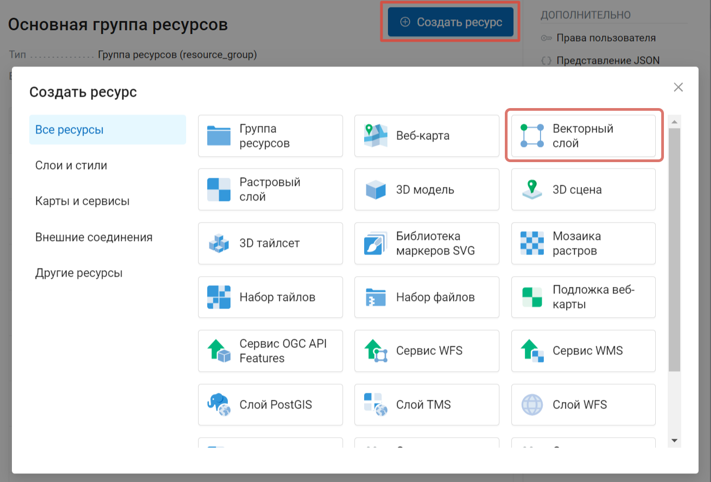
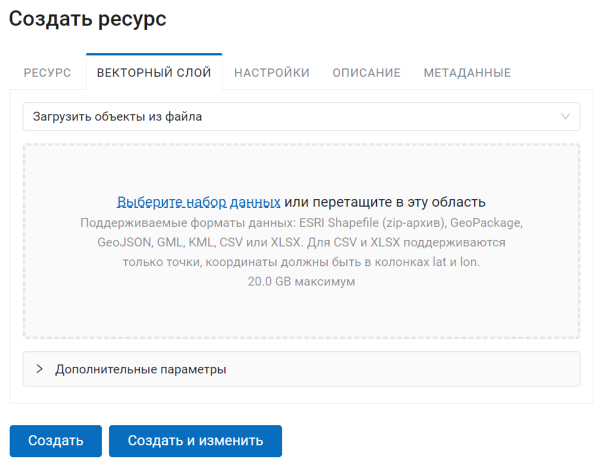
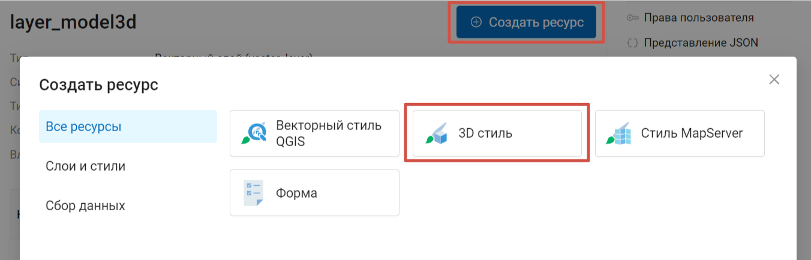
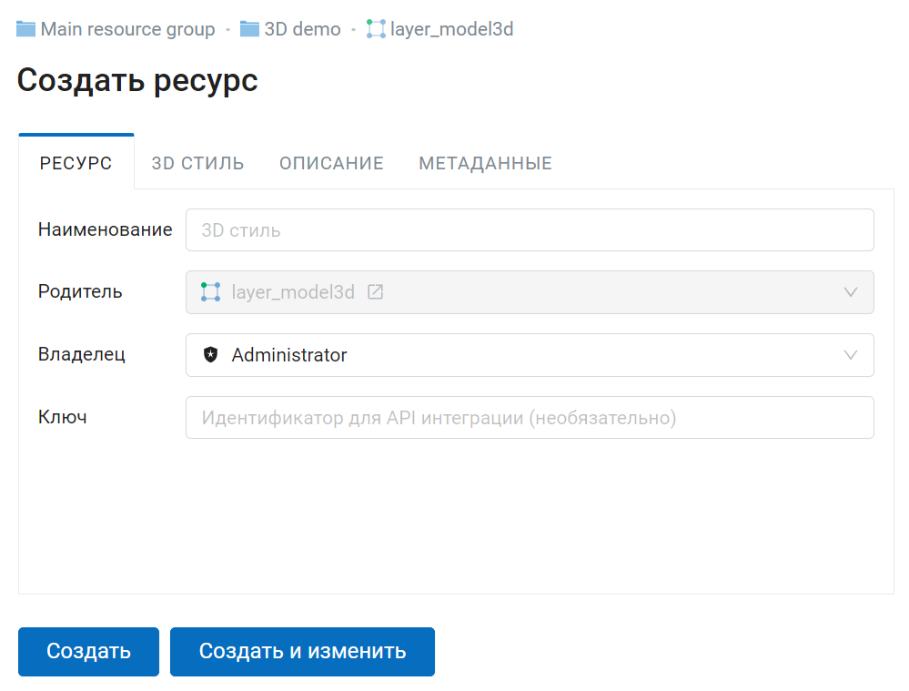
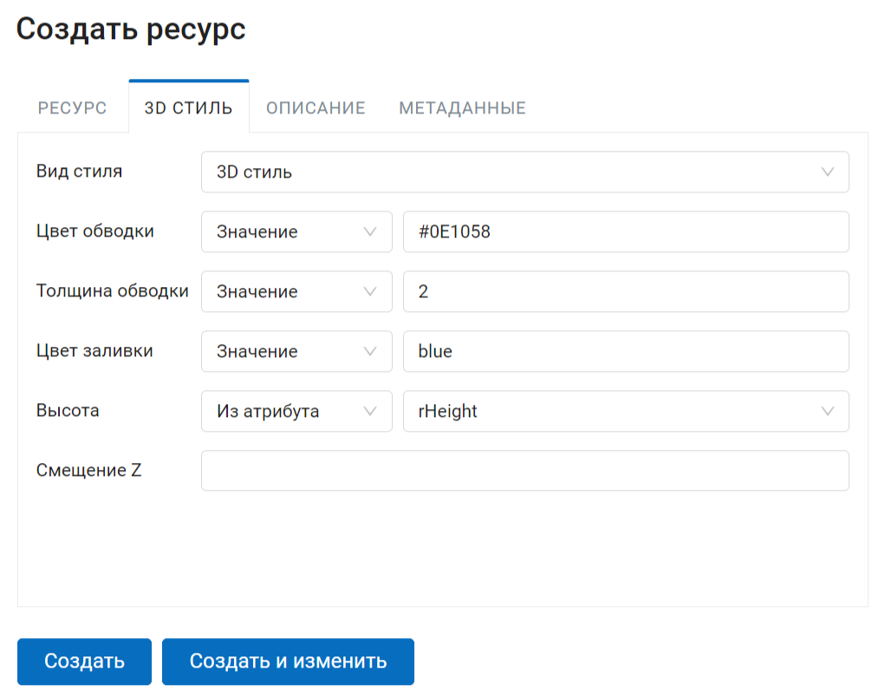
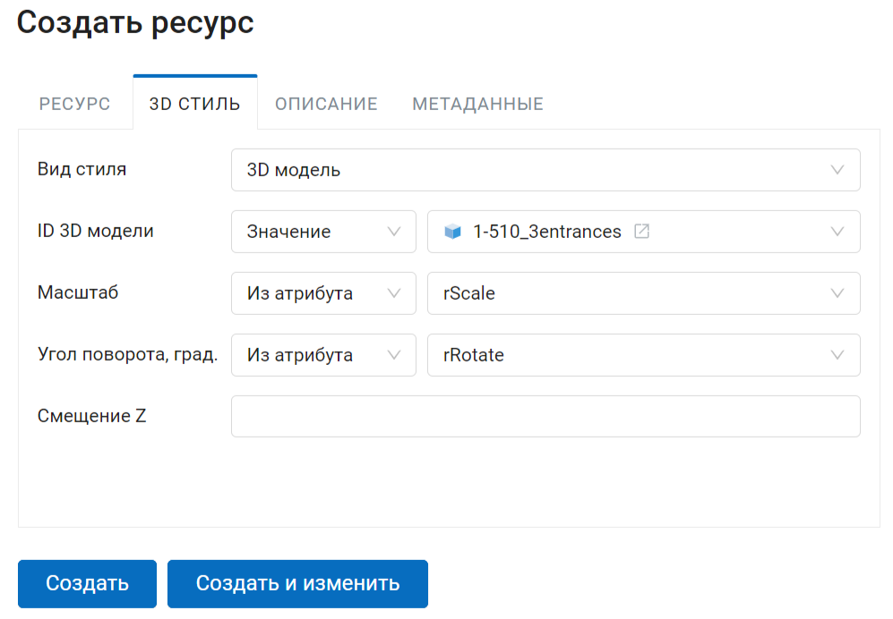
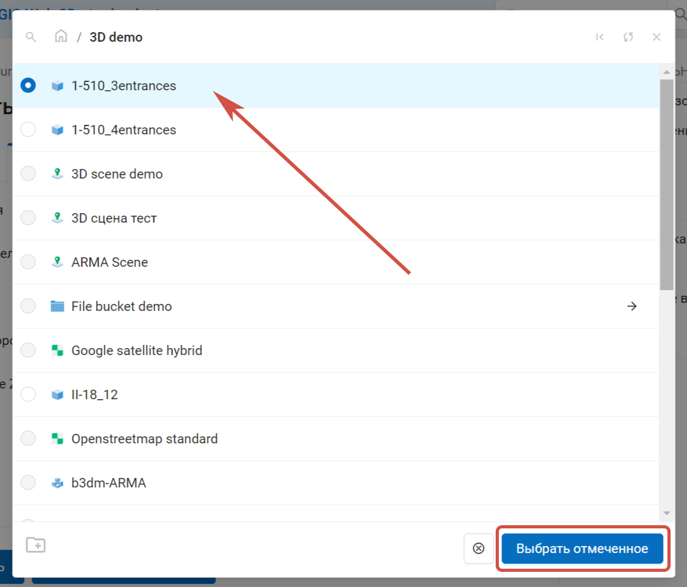
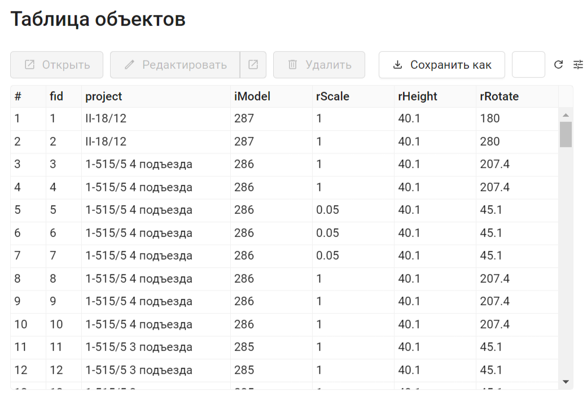

.. sectionauthor:: Роман Гайнуллов <roman.gainullov@nextgis.ru>

.. _ngw_3d_models:

Стили 3D данных
===============

.. _ngw_3d_style_general:

Общие вопросы
-------------

Стили 3D Данных применяются к векторным слоям, которые необходимо создать, выбрав соответствующий тип ресурса NextGIS Web (:numref:`ngw3D_select_vect_layer`).

   Создание ресурса “Векторный слой”
   
Поддерживаемые форматы данных: ESRI Shapefile (zip-архив), GeoPackage, GeoJSON, GML, KML, CSV или XLSX. Для CSV и XLSX поддерживаются только точки, координаты должны быть в колонках lat и lon.

   Загрузка данных векторного слоя

Стилизация векторного слоя осуществляется с помощью ресурса 3D стиль (:numref:`ngw3D_select_3D_style`), который является дочерним для ресурса векторного слоя.

   Выбор типа ресурса "3D стиль"

   Наименование ресурса 3D стиль

Права доступа, описание и метаданные являются опциональными настройками. Основные параметры задаются на вкладке *3D стиль*.

Существует несколько видов стилизации трёхмерных данных:

* Точки интереса
* 3D стиль
* 3D модель
* Сфера
* Эллипсоид

.. _ngw_3d_poi:

Точки интереса
---------------

**Точки интереса** - выбор стиля из предустановленных иконок. 

Настраиваемые параметры (:numref:`ngw3D_poi_3D_style`) (Для первых двух параметров можно задать константные значения или выбрать поля из таблицы атрибутов векторного слоя).

* Иконка 
* Цвет в CSS формате: название цвета (напр. red, blue) или код (напр. #0E1058)
* Приоритет
* Обратный порядок
* Смещение Z в метрах

.. figure:: _static/ngw3D_poi_3D_style.png
   :name: ngw3D_poi_3D_style
   :align: center
   :width: 20cm

   Настройки параметров 3D стиля Точки интереса

.. _ngw_3d_style:

3D Стиль
----------

Отображение слоя аналогично двухмерной веб-карте. 

Доступны следующие параметры стилизации геометрических примитивов:

* Цвет обводки в CSS формате: название цвета (напр. red, blue) или код (напр. #0E1058)
* Толщина обводки в пикселях
* Цвет заливки в CSS формате
* Высота в метрах
* Смещение Z в метрах

Для всех параметров, кроме смещения, можно не только задать константные значения, но и выбрать поля из таблицы атрибутов векторного слоя (:numref:`ngw3D_settings_3D_style`).

   Настройки параметров 3D стиля

.. _ngw_3d_model:

3D Модель
----------

Стилизация векторного слоя загруженной 3D моделью.

   Настройки параметров стиля 3D Модель

Настраиваемые параметры:

* ID 3D модели - значение (нужно выбрать ресурс во всплывающем окне)/поле таблицы атрибутов слоя, в котором содержится id 3D модели в NextGIS Web.

   Выбор 3D модели

   Таблица объектов слоя, поля атрибутов: iModel - ID 3D модели, rScale - масштаб, rRotate - угол поворота

* Масштаб - значение/поле таблицы атрибутов слоя, в котором содержится масштаб отображения модели (1 - масштаб один к одному, 0.5 - меньше в два раза, 2 - больше в два раза и т.п.)
* Угол поворота, в градусах - значение/поле таблицы атрибутов слоя, в котором содержится угол поворота модели

   
   

