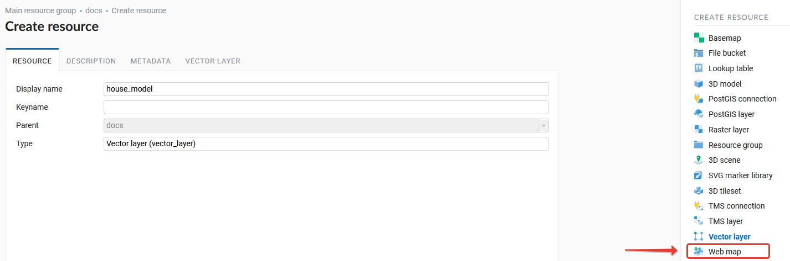
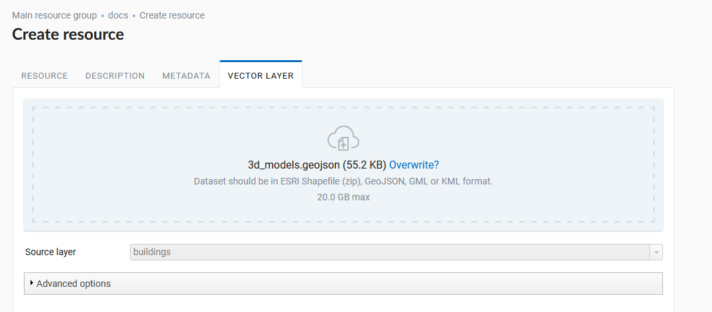
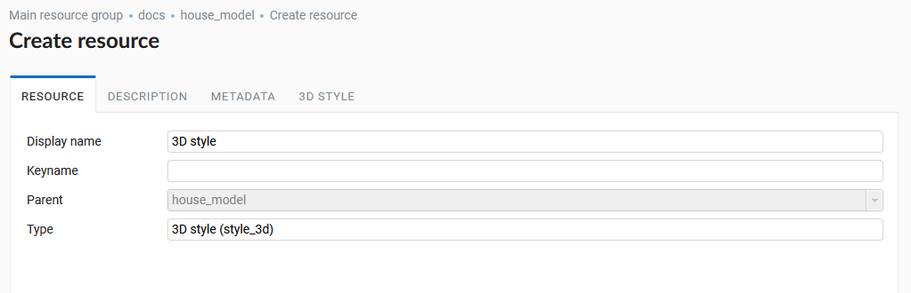
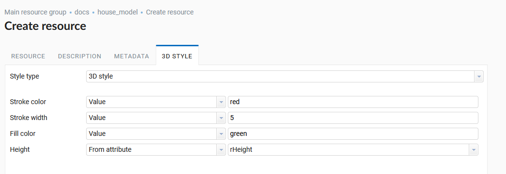
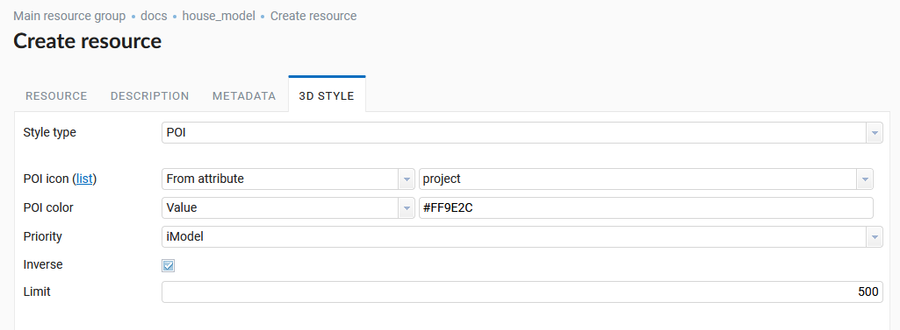
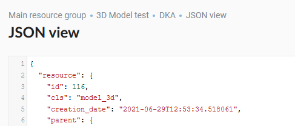
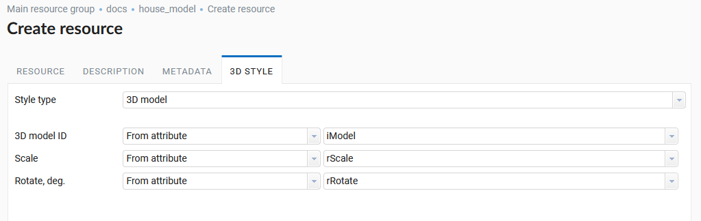

.. sectionauthor:: Roman Gainullov <roman.gainullov@nextgis.com>

.. _ngw_3d_models:

3D data Styles
===============

.. _ngw_3d_style_general:

General
-------

3D Data Styles are applied to vector layers that need to be created in advance by selecting the appropriate type of NextGIS Web resource (:numref:`ngw3D_select_vect_layer`) 
and uploading objects into it in the ESRI Shapefile or GeoJSON format (:numref:`ngw3D_upload_vect_data`).

   Creating a Vector Layer resource
   

   Uploading Vector layer data

Vector layer styling is carried out using the 3D style resource (:numref:`ngw3D_select_3D_style`) which is a child of the vector layer resource.

.. figure:: _static/ngw3D_select_3D_style.png
   :name: ngw3D_select_3D_style
   :align: center
   :width: 7cm

   3D style resource

At the first stage of creating a 3D style you must specify its name (:numref:`ngw3D_name_3D_style`).

   3D style resource name

Permissions, description and metadata are optional settings. The main parameters are set on the *3D style* tab.

There are three types of styling for 3D data:

* 3D style
* POI
* Model

.. _ngw_3d_style:

3D Стиль
----------

**3D style** - a display of the layer is similar to a 2D web map. 

The following options for styling geometric primitives are available:

* Stroke color
* Stroke width
* Fill color
* Height

You can set constant values or select fields from the vector layer attributes table (:numref:`ngw3D_settings_3D_style`).

    3D style settings

.. _ngw_3d_poi:

POI
---

**POI** - a style selection from preset icons. 

Adjustable parameters (:numref:`ngw3D_poi_3D_style`):

* POI Colour
* Priority
* Inverse
* Limit the number of points that will be rendered on the client with the prioritization

   POI 3D Style settings

.. _ngw_3d_model:

3D Model
----------

**3D Model** - styling a vector layer loaded 3D model.

Configurable parameters:

* 3D model ID - value / field of the layer attributes table, which contains the ID of the 3D model in NextGIS Web (:numref:`ngw3D_id_3D_model`)
* Scale - value/field of the layer attribute table, which contains the scale of the model display
* Rotate, degrees - value/field of the attribute table of the layer, which contains the rotation angle of the model in degrees (:numref:`ngw3D_grad_3D_model`)

   Resource identifier (id = 116) 3D model
   
   

   3D Model Style Settings
