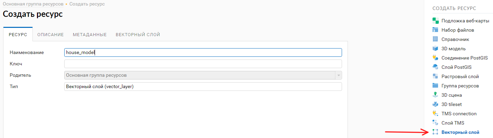
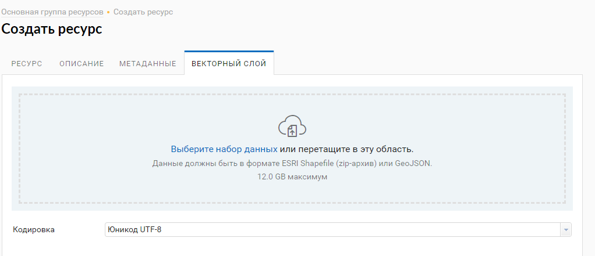
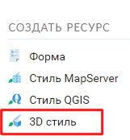
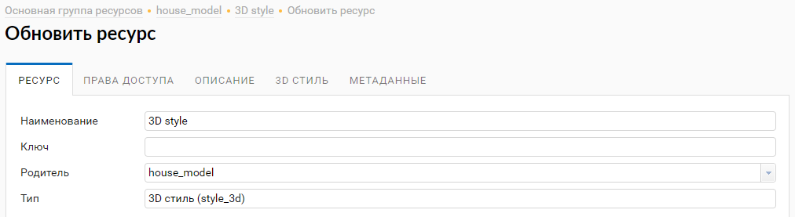
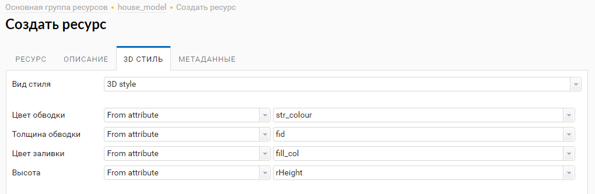
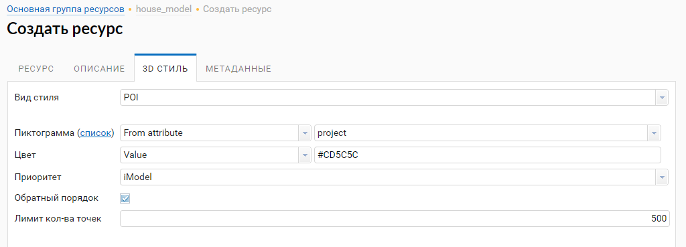
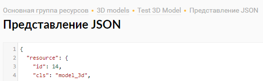
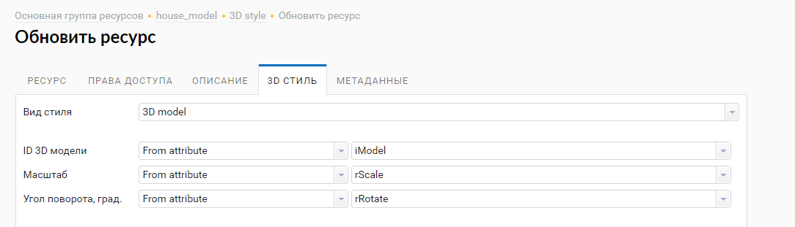

.. sectionauthor:: Роман Гайнуллов <roman.gainullov@nextgis.ru>

.. _ngw_3d_models:

Стили 3D данных
===============

.. _ngw_3d_style_general:

Общие вопросы
-------------

Стили 3D Данных применяются к векторным слоям, которые необходимо создать, выбрав соответствующий вид ресурса NextGIS Web (:numref:`ngw3D_select_vect_layer`) 
и загрузив в него объекты в формате ESRI Shapefile или GeoJSON (:numref:`ngw3D_upload_vect_data`).

   Создание ресурса “Векторный слой”
   

   Загрузка данных векторного слоя

Стилизация векторного слоя осуществляется с помощью ресурса 3D стиль (:numref:`ngw3D_select_3D_style`), который является дочерним для ресурса векторного слоя.

   Выбор ресурса "3D стиль"

На первом этапе создания 3D стиля необходимо указать его наименование (:numref:`ngw3D_name_3D_style`).

   Наименование ресурса 3D стиль

Права доступа, описание и метаданные являются опциональными настройками. Основные параметры задаются на вкладке *3D стиль*.

Существует три вида стилизации трёхмерных данных:

* 3D style
* POI
* Model

.. _ngw_3d_style:

3D Стиль
----------

**3D style** - отображение слоя аналогично двухмерной веб-карте. 

Доступны следующие параметры стилизации геометрических примитивов:

* Цвет обводки
* Ширина обводки
* Цвет заливки
* Высота

Можно задать константные значения или выбрать поля из таблицы атрибутов векторного слоя (:numref:`ngw3D_settings_3D_style`).

   Настройки параметров 3D стиля

.. _ngw_3d_poi:

POI
---

**POI** - выбор стиля из предустановленных иконок. 

Настраиваемые параметры (:numref:`ngw3D_poi_3D_style`):

* Цвет
* Приоритет
* Обратный порядок
* Лимит количества точек, которые будет отрисованы на клиенте с учетом приоритизации

   Настройки параметров POI 3D стиля

.. _ngw_3d_model:

3D Модель
----------

**3D Model** - стилизация векторного слоя загруженной 3D моделью.

Настраиваемые параметры:

* ID 3D модели - значение/поле таблицы атрибутов слоя, в котором содержится id 3D модели в NextGIS Web (:numref:`ngw3D_id_3D_model`)
* Масштаб - значение/поле таблицы атрибутов слоя, в котором содержится масштаб отображения модели
* Угол поворота, град. - значение/поле таблицы атрибутов слоя, в котором содержится угол поворота модели в градусах (:numref:`ngw3D_grad_3D_model`)

   Идентификатор (id = 14) ресурса 3D модель
   
   

   Настройки параметров стиля 3D Model
