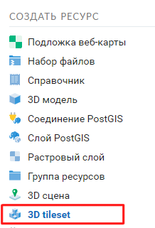
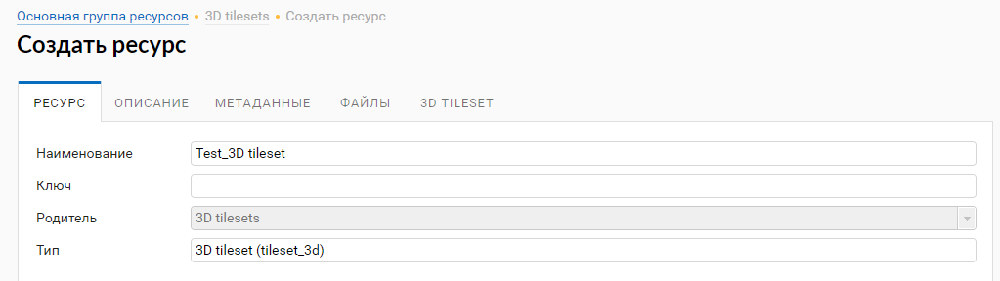
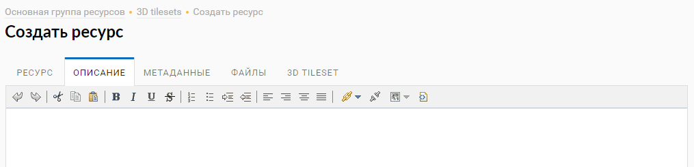
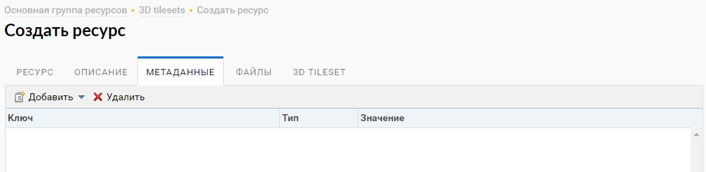
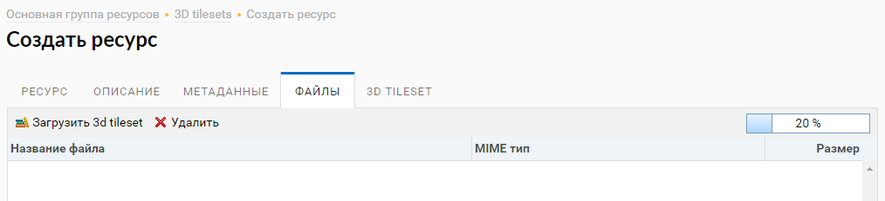
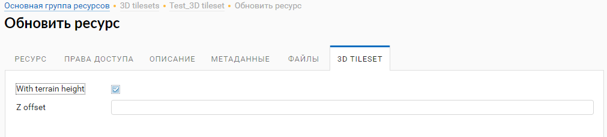
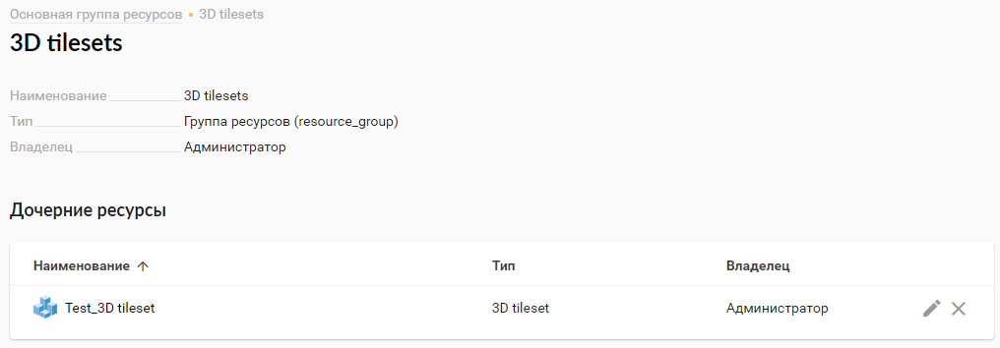

.. sectionauthor:: Роман Гайнуллов <roman.gainullov@nextgis.ru>

.. _ngw_3d_tilesets:

Загрузка и хранение трёхмерных наборов данных
=============================================

.. _ngw_3D_tileset:

**Что такое трехмерный набор данных** (спецификация формата приведена по `ссылке <https://github.com/CesiumGS/3d-tiles>`_) - это особый набор трёхмерных тайлов, 
которые умеет обрабатывать Cesium, организованный как пространственная структура данных в виде дерева.

.. _ngw_3D_tileset_formats:

**Какие форматы поддерживаются**  - cesium 3D tileset.
Набор тайлов описывается, по меньшей мере, одним файлом JSON, содержащим метаданные набора тайлов и дерево объектов тайлов, 
каждый из которых может ссылаться на обновляемое содержимое одного из следующих форматов:

* Batched 3D Model (b3dm)
* Instanced 3D Model (i3dm)
* Point Cloud (pnts)
* Composite (cmpt)

.. _ngw_3D_tileset_upload:

**Как выполнить загрузку трехмерного набора данных**.
Для загрузки трёхмерного набора данных необходимо создать ресурс “3D tileset” (:numref:`ngw3D_select_3D_tileset`).

   Выбор ресурса "3D tileset"

Процесс создания ресурса трехмерного набора данных выполняется пошагово и в интерфейсе разделяется на 5 вкладок. 
На первой необходимо задать наименование ресурса 3D tileset (:numref:`ngw3D_name_3D_tileset`). Это поле является обязательным.

   Наименование ресурса "3D tileset"

На второй вкладке существует возможность добавить текстовое описание ресурса в произвольной форме (:numref:`ngw3D_desc_3D_tileset`).

   Описание ресурса "3D tileset"

На третьей вкладке пользователь имеет возможность добавить метаданные к ресурсу 3D tileset (:numref:`ngw3D_metadata_3D_tileset`).

   Метаданные ресурса "3D tileset"

Четвертый шаг предполагает загрузку трехмерного набора данных с компьютера пользователя в виде zip-архива (:numref:`ngw3D_upload_3D_tileset`). 
Строка состояния будет отображать процесс текущей загрузки.

   Загрузка zip-архива трёхмерного набора данных 

Пятая вкладка 3D TILESET определяет величину смещения набора данных по оси Z и корреляцию с данными рельефа - 
в случае выбора опции нулевой уровень тайлсета будет выставлен по высотам рельефа (:numref:`ngw3D_settings_3D_tileset`).

   Настройки учета высоты рельефа и смещения тайлсета по оси Z

После нажатия пользователем кнопки “Сохранить” ресурс 3D tileset будет создан в указанной директории NextGIS Web (:numref:`ngw3D_finished_1_3D_tileset`) (:numref:`ngw3D_finished_2_3D_tileset`).

.. figure:: _static/ngw3D_finished_2_3D_tileset.png
   :name: ngw3D_settings_3D_tileset
   :align: center
   :width: 20cm

   3D tileset в директории NextGIS Web
