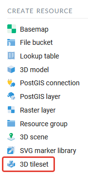
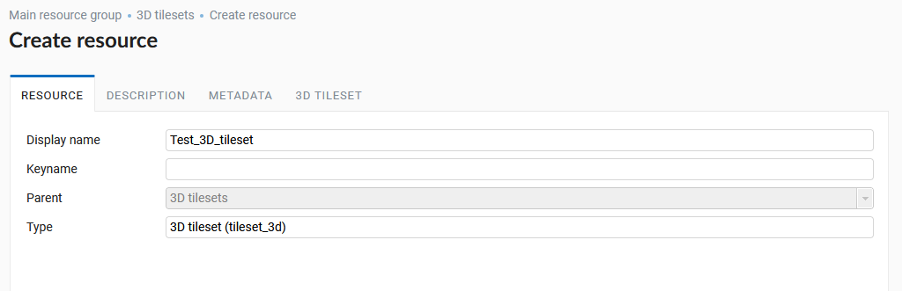
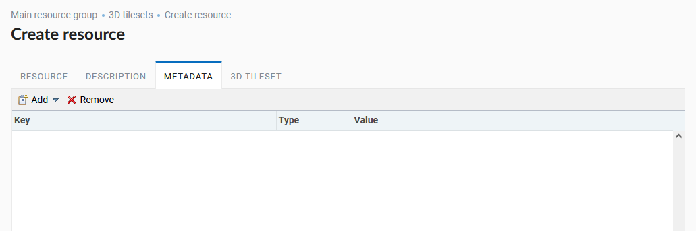
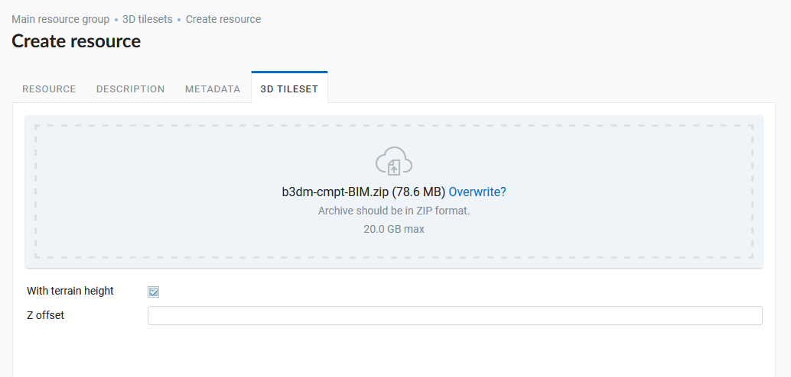
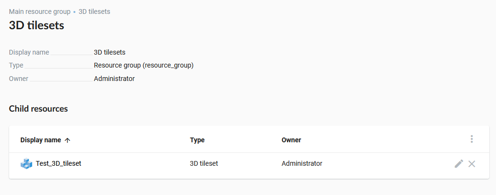

.. sectionauthor:: Roman Gainullov <roman.gainullov@nextgis.com>

.. _ngw_3d_tilesets:

Uploading and storing 3D datasets
=================================

.. _ngw_3D_tileset:

**What is a three-dimensional dataset** (format specification given on the `link <https://github.com/CesiumGS/3d-tiles>`_) - a special set of three-dimensional tiles,
which can handle Cesium, organized as a spatial data structure as a tree.

.. _ngw_3D_tileset_formats:

**What formats are supported**  - cesium 3D tileset.
A tileset is described by at least one JSON file containing tileset metadata and a tree of tile objects,
each of which can refer to updated content in one of the following formats:

* `Batched 3D Model (b3dm) <https://github.com/CesiumGS/3d-tiles/blob/master/specification/TileFormats/Batched3DModel/README.md>`_
* `Instanced 3D Model (i3dm) (b3dm) <https://github.com/CesiumGS/3d-tiles/blob/master/specification/TileFormats/Instanced3DModel/README.md>`_
* `Point Cloud (pnts) <https://github.com/CesiumGS/3d-tiles/blob/master/specification/TileFormats/PointCloud/README.md>`_
* `Composite (cmpt) <https://github.com/CesiumGS/3d-tiles/blob/master/specification/TileFormats/Composite/README.md>`_

.. _ngw_3D_tileset_upload:

**How to upload a 3D dataset**.
To upload a three-dimensional dataset you need to create a “3D tileset” resource (:numref:`ngw3D_select_3D_tileset`).

   Resource selection "3D tileset"

The process of creating a 3D tileset resource is performed step by step and is divided into 5 tabs in the interface.
The first one is to set the name of the 3D tileset resource (:numref:`ngw3D_name_3D_tileset`). This field is required.

   Resource name "3D tileset"

On the second tab it is possible to add a textual description of the resource in any form (:numref:`ngw3D_desc_3D_tileset`).

.. figure:: _static/ngw3D_desc_3D_tileset_en.png
   :name: ngw3D_desc_3D_tileset
   :align: center
   :width: 20cm

   3D tileset Resource description tab

On the third tab the user can add metadata to the 3D tileset resource (:numref:`ngw3D_metadata_3D_tileset`).

   3D tileset Resource metadata tab

The fourth tab 3D TILESET involves uploading a 3D dataset from the user's computer in a zip archive.
And also defines the offset value of the dataset along the Z axis and the correlation with the terrain data - if the option is selected,
the zero level of the tileset will be set to the terrain height (:numref:`ngw3D_upload_3D_tileset`). 

   Uploading a 3D dataset and settings of a terrain height and tilesets displacement along the Z axis

After clicking the “Create” button the 3D tileset resource will be created in the specified NextGIS Web directory (:numref:`ngw3D_finished_1_3D_tileset`).

   3D tileset in NextGIS Web directory
