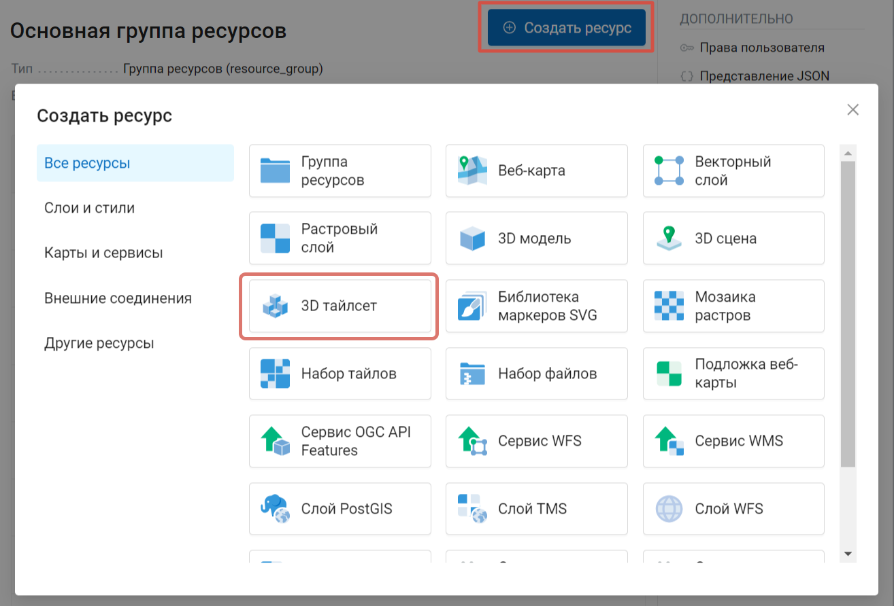
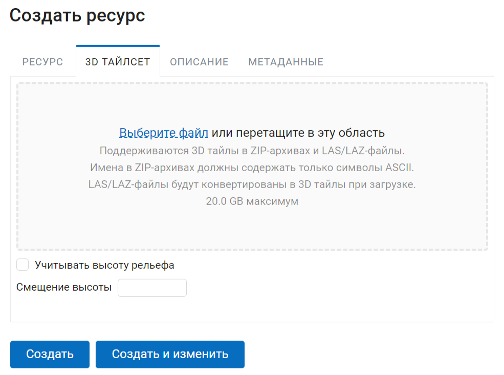
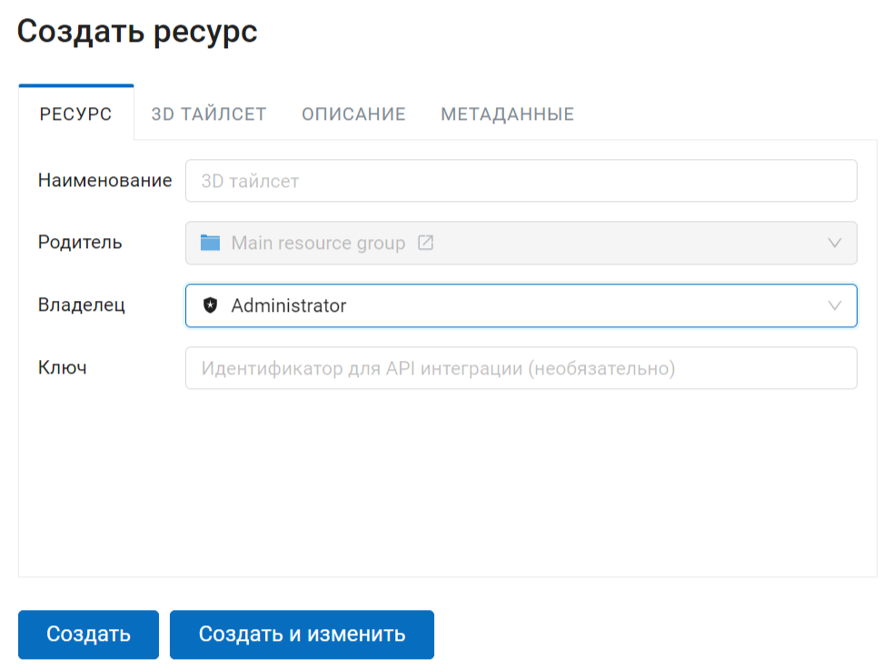
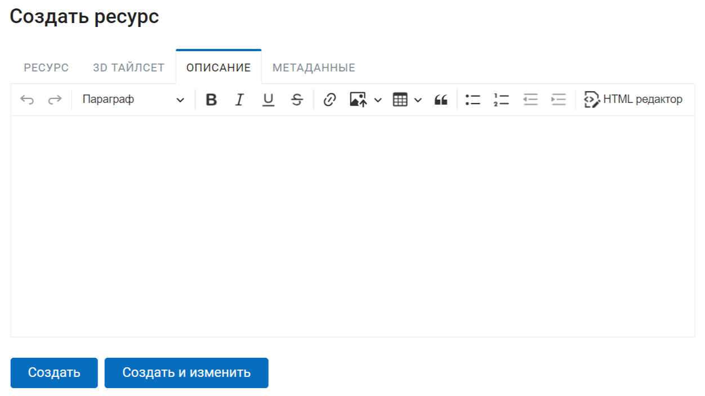
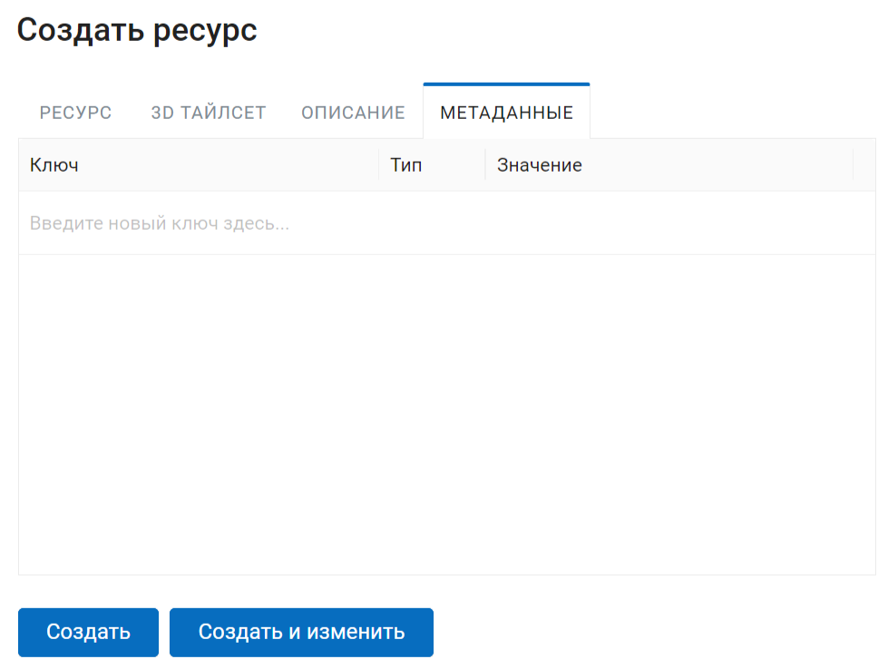

.. sectionauthor:: Роман Гайнуллов <roman.gainullov@nextgis.ru>

.. _ngw_3d_tilesets:

Загрузка и хранение трёхмерных наборов данных
=============================================

.. _ngw_3D_tileset:

**Что такое трехмерный набор данных** (спецификация формата приведена по `ссылке <https://github.com/CesiumGS/3d-tiles>`_) - это особый набор трёхмерных тайлов, 
которые умеет обрабатывать Cesium, организованный как пространственная структура данных в виде дерева.

.. _ngw_3D_tileset_formats:

Какие форматы поддерживаются
-----------------------------

Поддерживаемый формат - cesium 3D tileset.
Набор тайлов описывается, по меньшей мере, одним файлом JSON, содержащим метаданные набора тайлов и дерево объектов тайлов, каждый из которых может ссылаться на обновляемое содержимое одного из следующих форматов:

* `Batched 3D Model (b3dm) <https://github.com/CesiumGS/3d-tiles/blob/master/specification/TileFormats/Batched3DModel/README.md>`_
* `Instanced 3D Model (i3dm) (b3dm) <https://github.com/CesiumGS/3d-tiles/blob/master/specification/TileFormats/Instanced3DModel/README.md>`_
* `Point Cloud (pnts) <https://github.com/CesiumGS/3d-tiles/blob/master/specification/TileFormats/PointCloud/README.md>`_
* `Composite (cmpt) <https://github.com/CesiumGS/3d-tiles/blob/master/specification/TileFormats/Composite/README.md>`_

Поддерживаются 3D тайлы в ZIP-архивах и LAS/LAZ-файлы. LAS/LAZ-файлы будут конвертированы в 3D тайлы при загрузке.

.. warning::
         Имена в ZIP-архивах должны содержать только символы ASCII. 

.. _ngw_3D_tileset_upload:

Как выполнить загрузку трехмерного набора данных
------------------------------------------------

Для загрузки трёхмерного набора данных необходимо создать ресурс “3D тайлсет”. Перейдите в группу ресурсов (папку), в которой необходимо его создать. Нажмите кнопку Создать ресурс и выберите во всплывающем окне тип ресурса.

   Выбор ресурса "3D тайлсет"

В открывшемся окне на вкладке «3D тайлсет» необходимо загрузить файл в формате FBX и GLB.

Строка состояния будет отображать процесс текущей загрузки.

   Загрузка zip-архива трёхмерного набора данных 

Также на этой вкладке можно задать величину смещения набора данных по оси Z (в метрах) и корреляцию с данными рельефа. 
В случае выбора опции "Учитывать данные рельефа" нулевой уровень тайлсета будет выставлен по высотам рельефа (:numref:`ngw3D_upload_3D_tileset`).

Во вкладке «Наименование» укажите наименование ресурса, которое будет отображаться в административном интерфейсе.

   Наименование ресурса "3D tileset"

На вкладке «Описание» можно добавить произвольный текст, описывающий содержимое данного ресурса (:numref:`ngw3D_desc_3D_tileset`).

   Описание ресурса "3D тайлсет"

Также пользователь имеет возможность добавить к ресурсу 3D тайлсет метаданные в формате ключ-значение (:numref:`ngw3D_metadata_3D_tileset`).

   Метаданные ресурса "3D тайлсет"

После нажатия пользователем кнопки **Сохранить** ресурс 3D тайлсет будет создан в указанной директории NextGIS Web (:numref:`ngw3D_finished_1_3D_tileset`).

.. figure:: _static/ngw3D_finished_1_3D_tileset_ru.png
   :name: ngw3D_finished_1_3D_tileset
   :align: center
   :width: 16cm

   3D тайлсет в директории NextGIS Web

