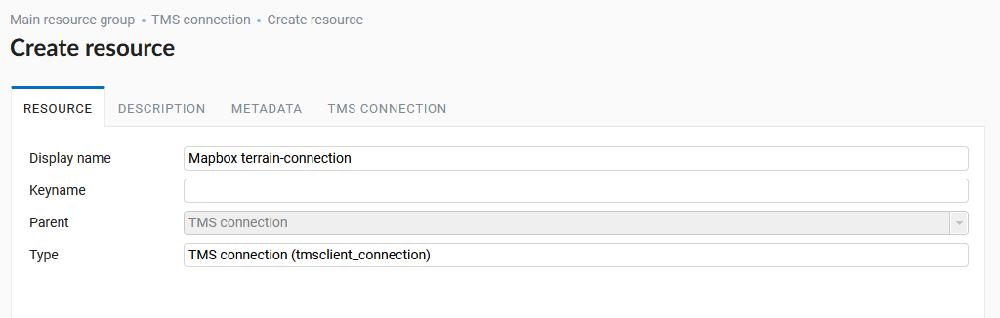
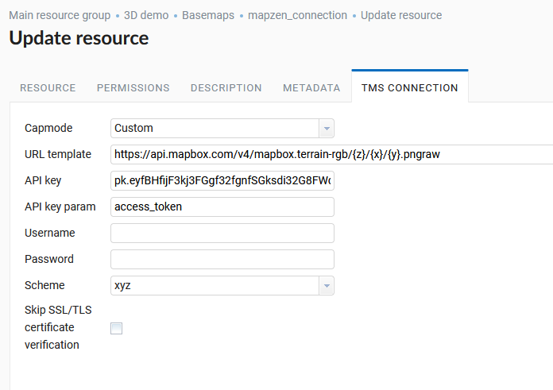
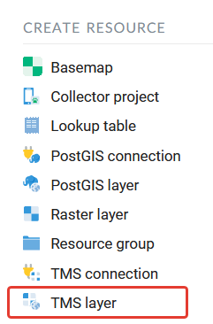
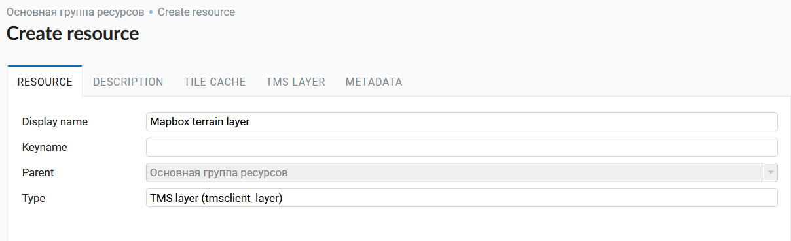
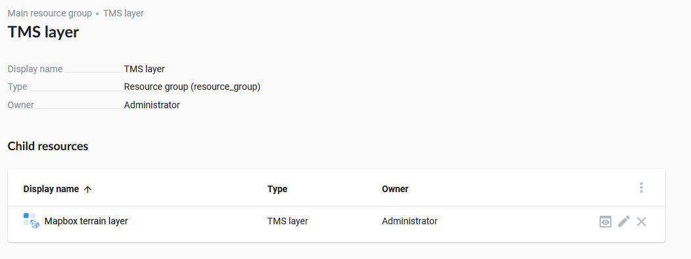
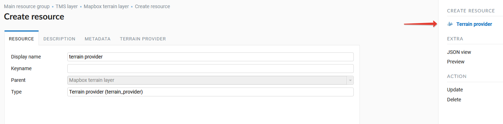
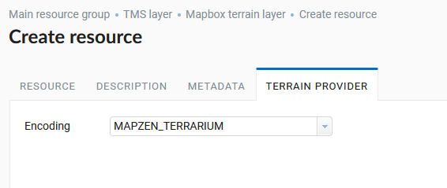

.. sectionauthor:: Roman Gainullov <roman.gainullov@nextgis.com>

.. _ngw_3d_dem:

Uploading elevation data
========================

**What is a terrain (DEM - Digital elevation model)** - is a digital representation of the earth's surface as a continuous phenomenon describing it with some precision,
in the form of a raster or regular grid of cells of a given size.

For the Cesium client the relief is a TMS service in the EPSG: 4326 projection which renders tiles in a special quantized-mesh format.
As a source of heights the terrain provider uses either a raster layer with a loaded single-band image or a TMS service that returns heights in a specially encoded RGB raster.

Of the TMS services, Mapzen and Mapbox are supported.

**Getting mesh from TMS connection**.

To connect the **Terrain-RGB terrain** you need to create a **TMS connection** (:numref:`ngw3D_select_TMS_connection`).

.. figure:: _static/ngw3D_select_TMS_connection_en.png
   :name: ngw3D_select_TMS_connection
   :align: center
   :width: 10cm

   Selecting a TMS connection resource

The first step is to name the TMS connection (:numref:`ngw3D_name_TMS_connection`).

   Selecting a TMS connection resource

Description and metadata tabs are optional. When creating a connection be sure to configure the parameters of the TMS connection tab (:numref:`ngw3D_settings_TMS_connection`). 
To connect to the Mapbox terrain you need to specify a custom connection method, URL template, parameter and the API key itself, auth username and password.
All settings are described `here <https://docs.mapbox.com/help/troubleshooting/access-elevation-data/#mapbox-terrain-rgb>`_,
an api-key of access token is generated when logging on https://account.mapbox.com/.
You can also Skip SSL/TLS certificate verification and specify tiling scheme. After you specify all the parameters created TMS connection (:numref:`ngw3D_finished_TMS_connection`).

   TMS connection resource settings

.. figure:: _static/ngw3D_finished_TMS_connection.png
   :name: ngw3D_finished_TMS_connection
   :align: center
   :width: 20cm

   Created TMS connection resource in NextGIS Web

Next you need to create a TMS layer for the Mapbox terrain based on the ready-made TMS connection (:numref:`ngw3D_select_TMS_layer`).

   TMS layer resource selection
   
By analogy with other types of resources the name, description and metadata are also set. (:numref:`ngw3D_name_TMS_layer`).

   TMS layer resource selection

The TMS layer tab contains settings for connection through the TMS connection resource created earlier which must be specified in the appropriate field (:numref:`ngw3D_connection_TMS_layer`). 
If necessary you should specify additional parameters depending on the specifics of the loaded terrain.
For Mapbox terrain you must specify the maximum zoom level - 15 (:numref:`ngw3D_zoom_TMS_layer`).

.. figure:: _static/ngw3D_connection_TMS_layer_en.png
   :name: ngw3D_connection_TMS_layer
   :align: center
   :width: 10cm

   Selecting TMS connection resource for TMS layer

.. figure:: _static/ngw3D_zoom_TMS_layer_en.png
   :name: ngw3D_zoom_TMS_layer
   :align: center
   :width: 20cm

   TMS layer connection parameters

After saving the TMS layer it will appear in the corresponding NextGIS Web directory (:numref:`ngw3D_finished_TMS_layer`), 
and its child resource, **Terrain**, will become available (:numref:`ngw3D_select_terrain_provider`).
For it, you must specify the name and encoding (:numref:`ngw3D_encoding_terrain_provider`).

   TMS layer connection parameters

   Child resource ‘Terrain provider’ of the TMS layer
   
   

   Terrain encoding selection

After creating a resource it will appear in the corresponding NextGIS Web directory (:numref:`ngw3D_finished_terrain_provider`).

.. figure:: _static/ngw3D_finished_terrain_provider.png
   :name: ngw3D_finished_terrain_provider
   :align: center
   :width: 20cm

   Created resource ‘Terrain provider’ in NextGIS Web
