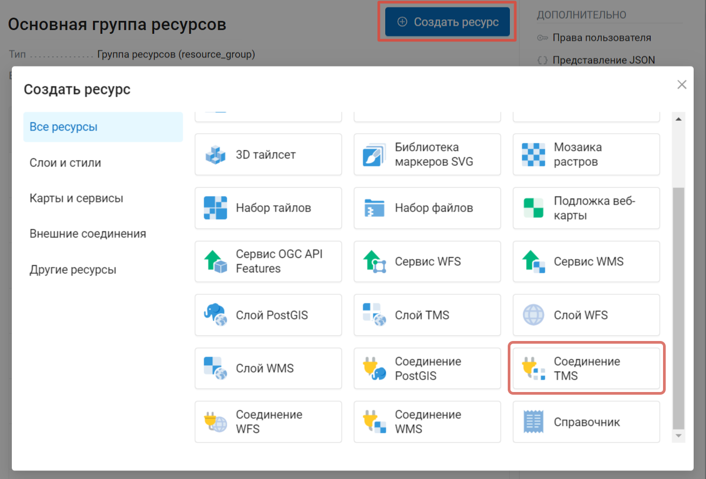
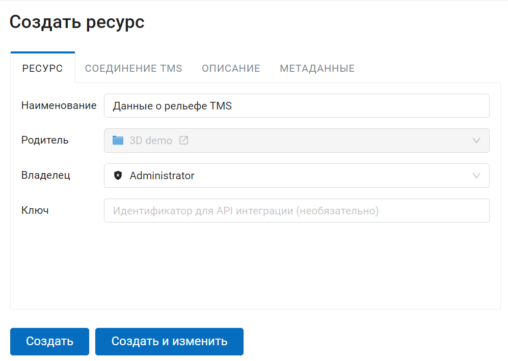
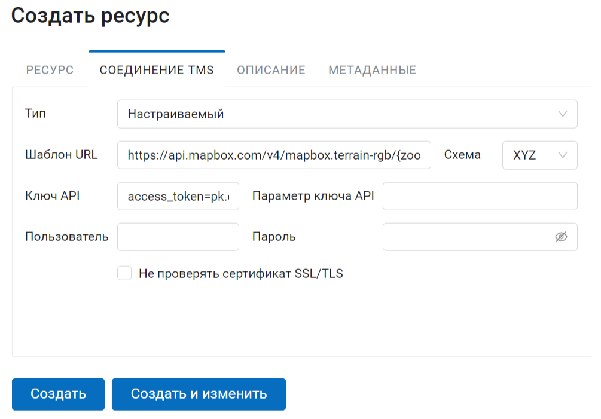
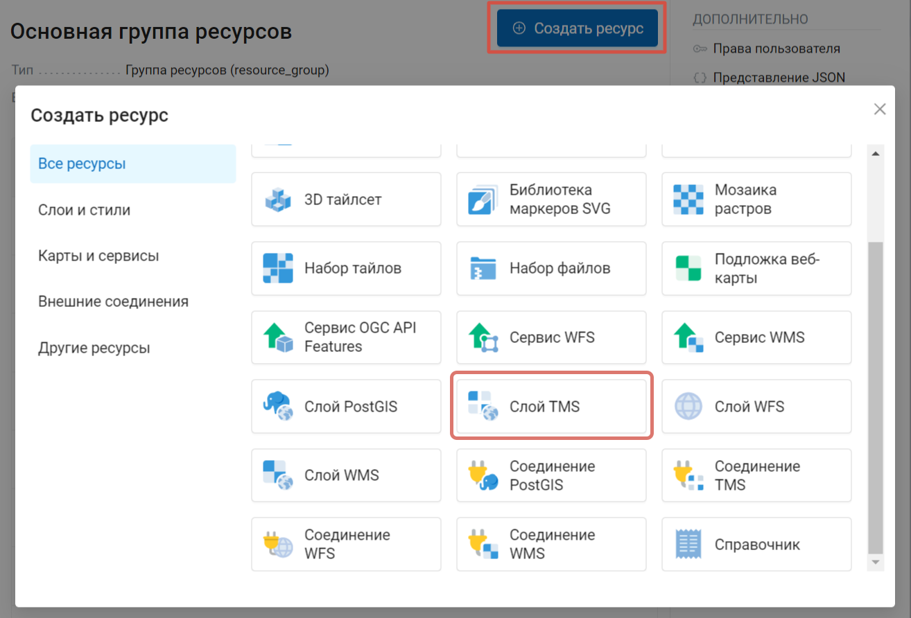
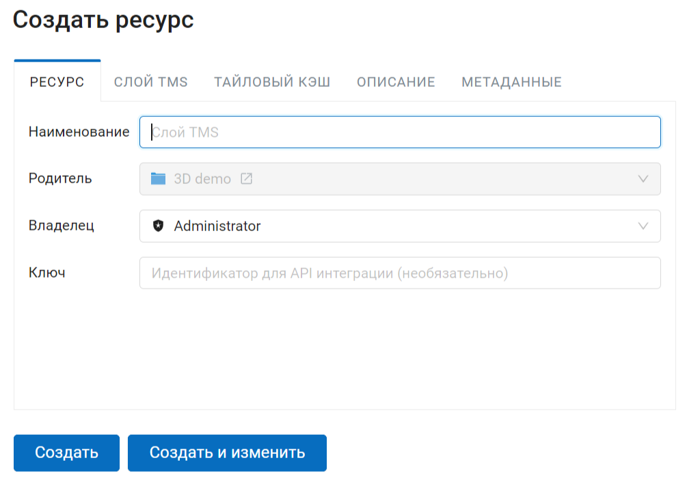
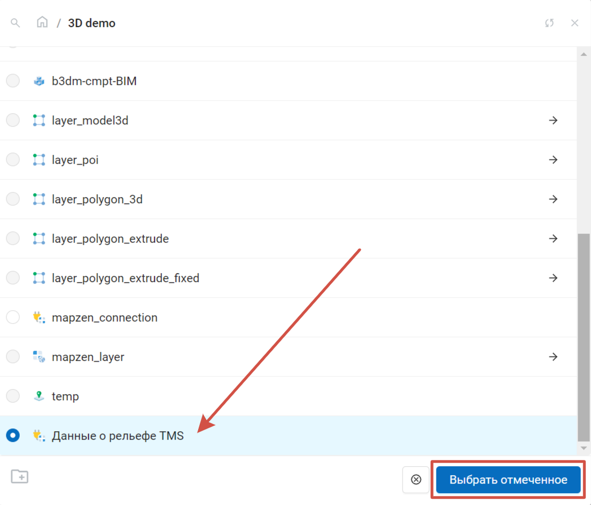
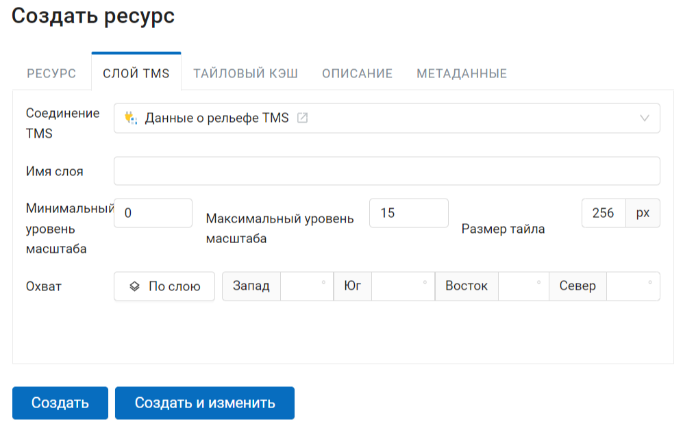
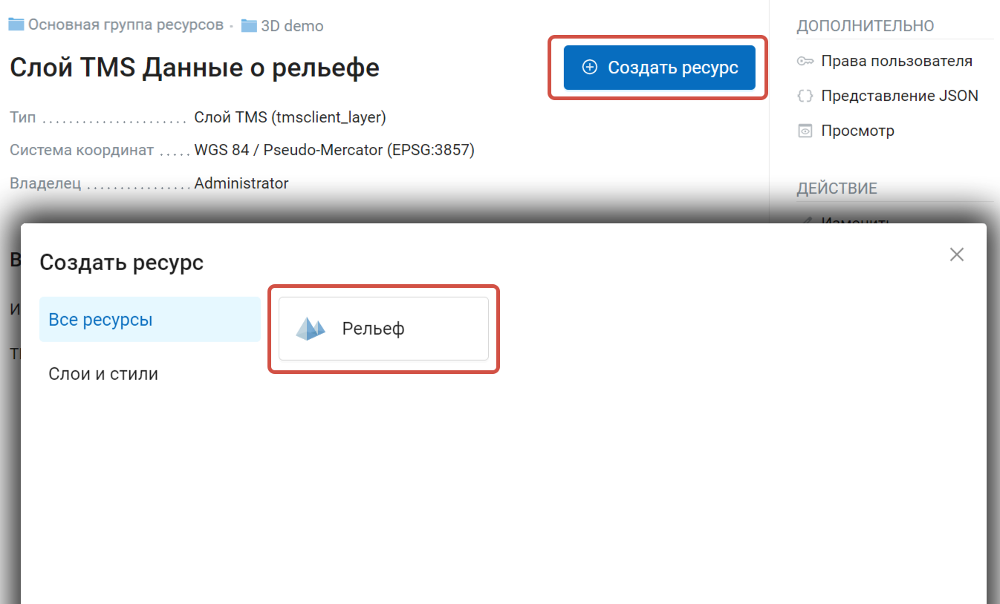
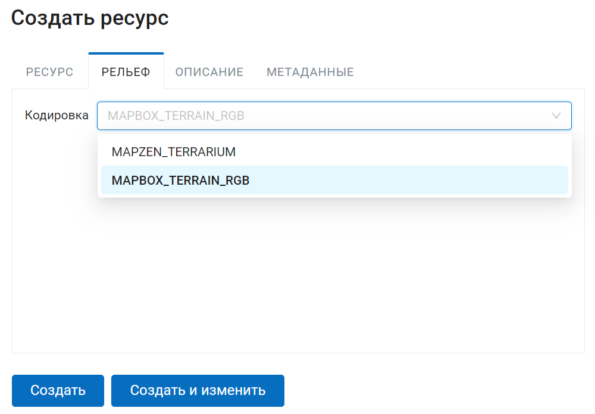
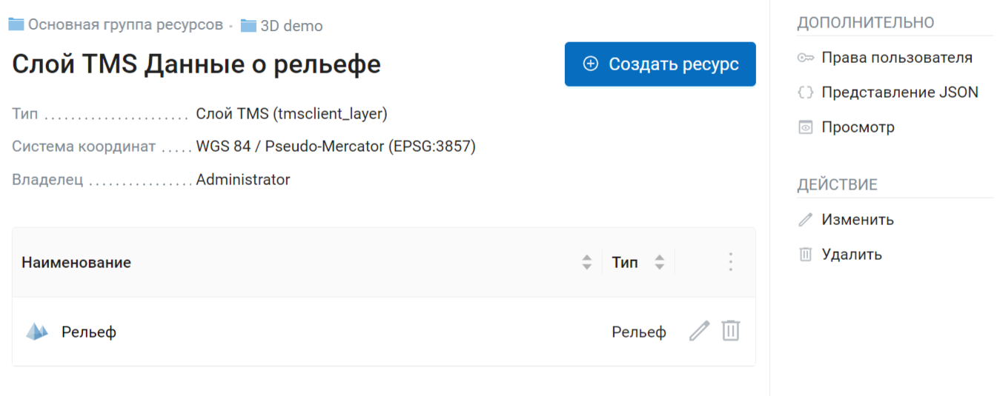

.. sectionauthor:: Роман Гайнуллов <roman.gainullov@nextgis.ru>

.. _ngw_3d_dem:

Загрузка данных о рельефе
=========================

**Что такое рельеф (DEM - Digital elevation model)** - это цифровое представление земной поверхности как непрерывного явления, 
описывающее ее с определенной точностью, в виде растра или регулярной сети ячеек заданного размера.

Для клиента Cesium рельеф представляет собой TMS-сервис в проекции EPSG:4326, отдающий тайлы в специальном формате - quantized-mesh. 
В качестве источника высот terrain provider использует либо растровый слой с загруженным одноканальным изображением либо TMS-сервис, 
отдающий высоты в особо закодированном RGB растре.

Из TMS-сервисов поддерживаются Mapzen и Mapbox.

**Получение mesh из TMS подключения**.

Для подключения рельефа **Terrain-RGB** необходимо создать **Соединение TMS** (:numref:`ngw3D_select_TMS_connection`).

   Выбор ресурса "Соединение TMS"

На первом шаге необходимо дать название соединению TMS (:numref:`ngw3D_name_TMS_connection`).

   Наименование соединения TMS

Вкладки описание и метаданные являются опциональными. При создании подключения обязательно нужно настроить параметры вкладки Соединение TMS (:numref:`ngw3D_settings_TMS_connection`). 
Для подключения к рельефу Mapbox нужно указать настраиваемый способ подключения, шаблон URL, параметр и сам ключ API. 
Все параметры описаны `здесь <https://docs.mapbox.com/help/troubleshooting/access-elevation-data/#mapbox-terrain-rgb>`_, api-ключ access-токена генерируется при авторизации на https://account.mapbox.com/. 
После указания всех параметров создается TMS подключение (:numref:`ngw3D_finished_TMS_connection`).

   Настройка ресурса "Соединение TMS"

.. figure:: _static/ngw3D_finished_TMS_connection.png
   :name: ngw3D_finished_TMS_connection
   :align: center
   :width: 20cm

   Созданный ресурс Соединение TMS в NextGIS Web

Далее необходимо создать TMS слой для рельефа Mapbox на базе готового соединения TMS (:numref:`ngw3D_select_TMS_layer`).

   Выбор типа создаваемого ресурса "Слой TMS"
   
   
По аналогии с остальными ресурсами задается наименование, описание и метаданные (:numref:`ngw3D_name_TMS_layer`).

   Наименование ресурса "Слой TMS"

Вкладка Слой TMS содержит настройки для подключения через созданный ранее ресурс Соединение TMS, который необходимо указать в соответствующем поле (:numref:`ngw3D_connection_TMS_layer`). 
При необходимости стоит указать дополнительные параметры в зависимости от специфики загружаемого рельефа. 
Для Mapbox terrain необходимо указать максимальный уровень масштаба - 15 (:numref:`ngw3D_zoom_TMS_layer`).

   Выбор соединения TMS для TMS слоя

   Параметры подключения TMS слоя

После сохранения TMS слоя он появится в соответствующей директории NextGIS Web (:numref:`ngw3D_finished_TMS_layer`).

.. figure:: _static/ngw3D_finished_TMS_layer_ru.png
   :name: ngw3D_finished_TMS_layer
   :align: center
   :width: 16cm

   TMS слой в директории NextGIS Web

В меню "Создать ресурс" станет доступен его дочерний ресурс - **Рельеф** (:numref:`ngw3D_select_terrain_provider`). 

   Выбор типа создаваемого ресурса "Рельеф"

Для него необходимо указать наименование и способ кодировки (:numref:`ngw3D_encoding_terrain_provider`).
   

   Выбор кодировки рельефа

После создания ресурса он появится в соответствующей директории NextGIS Web (:numref:`ngw3D_finished_terrain_provider`).

   Созданный ресурс Рельеф в NextGIS Web

