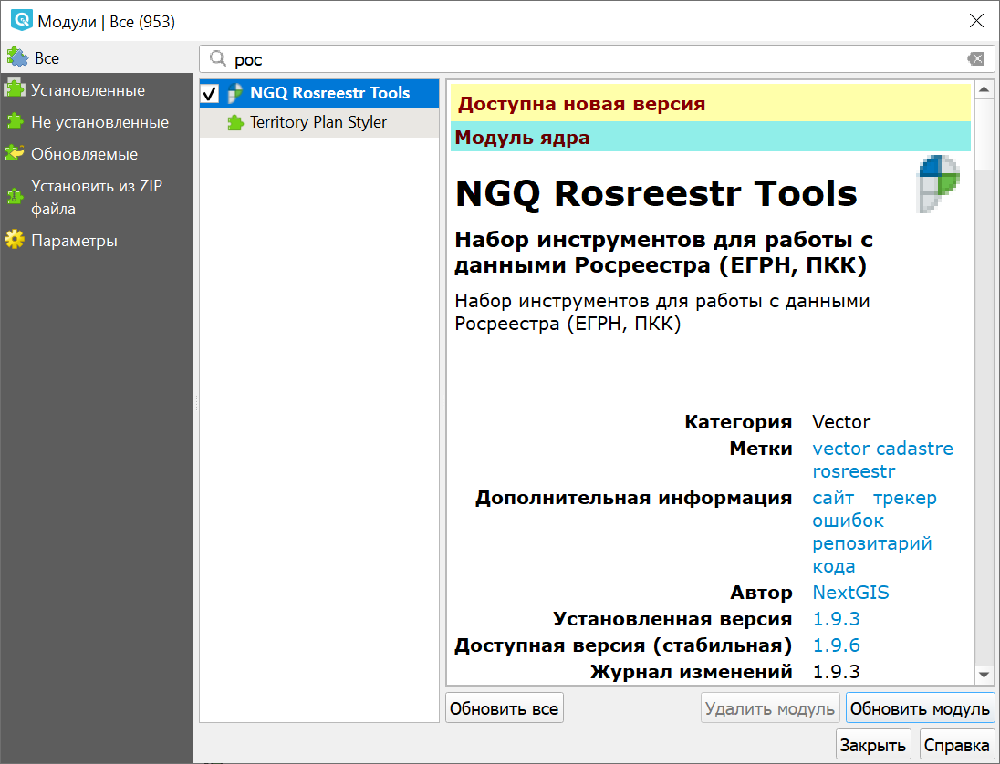
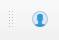
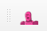

.. sectionauthor:: Роман Гайнуллов <roman.gainullov@nextgis.ru>

.. _NGQ Rosreestr Tools:

Обзор NGQ Rosreestr Tools
===================

.. important::
   На `специальной <https://nextgis.ru/blog/rr-tools-event/>`_ странице вы можете ознакомиться с онлайн-записью и материалами вебинара, посвященного работе данного модуля.

Модуль **NGQ Rosreestr Tools** предназначен для работы с кадастровыми данными и сервисами Росреестра (ЕГРН, ПКК). 

.. note::
   Данный инструмент доступен только для пользователей `плана Premium <https://nextgis.ru/nextgis-com/plans>`_ и NextGIS Web `для своего сервера <https://nextgis.ru/pricing/>`_. Вы можете быть владельцем плана Premium или состоять в его команде.
   Данный инструмент присутствует только в ПО `NextGIS QGIS <https://nextgis.ru/nextgis-qgis/>`_.

.. warning::

   NextGIS не несет ответственности за работоспособность сервисов Росреестра. Периодическая недоступность сервисов Росреестра - регулярное явление и может повлиять на работу некоторых функций модуля.

Модуль реализует следующие возможности:

* Отображение кадастровых участков, кварталов, районов, округов в виде единого растрового слоя;
* Отображение карточки объекта (участка, квартала, зоны, района, округа) при клике мышью;
* Подсветка объекта по которому отображается карточка;
* Поиск объекта по номеру и позиционирование на нем;
* Импорт данных из выписок ЕГРН (КПТ, КВЗУ, :ref:`полный список<ngq_rr_import>`);
* Сохранение объектов во временный слой при поиске и идентификации.

Установка и обновление
-------------

Для установки или обновления модуля необходимо выбрать в меню Модули ‣ Управление модулями.
Введите часть или все его название в панель Поиск (см. :numref:`list_modules_rr`).

   
   Список установленных и доступных к загрузке модулей

Выберите в списке нужный модуль и выберите **Установить модуль**. Если модуль уже установлен, но вышла новая версия, выберите **Обновить модуль**.

Авторизация
-----------

Для того, чтобы активировать возможности расширения, необходимо авторизоваться в `NextGIS Account Toolbar <https://docs.nextgis.ru/docs_ngqgis/source/auth.html>`_, также ваш пользователь должен быть на плане **Премиум** (https://nextgis.ru/pricing-base).
Панель **NextGIS Account Toolbar** для неавторизованных пользователей выглядит так: |not_auth|. При нажатии на иконку вам будет предложено авторизоваться в системе через браузер.

В случае успешной авторизации иконка на панели NextGIS Account Toolbar сменится на другую: |auth_icon|.

После установки расширения появляется набор иконок на панели инструментов (заблокированная для неавторизованных пользователей).
