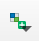
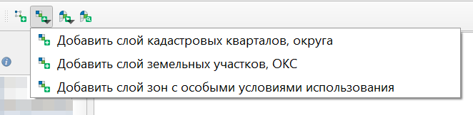
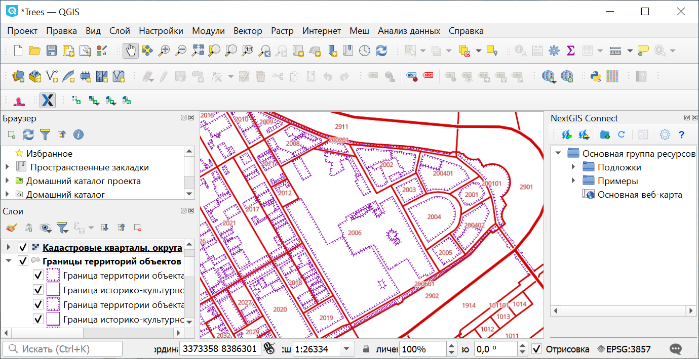
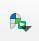
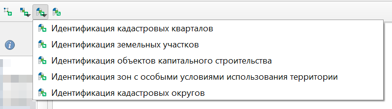
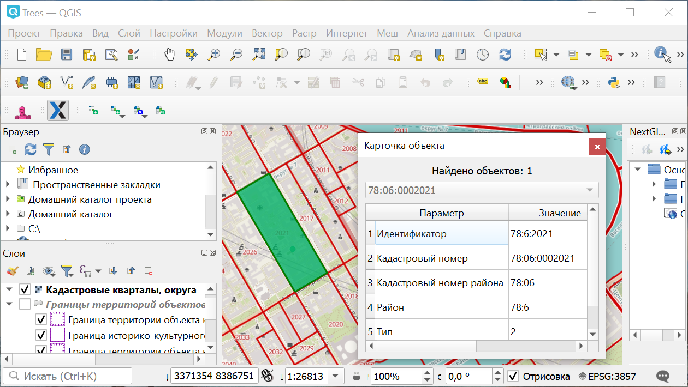
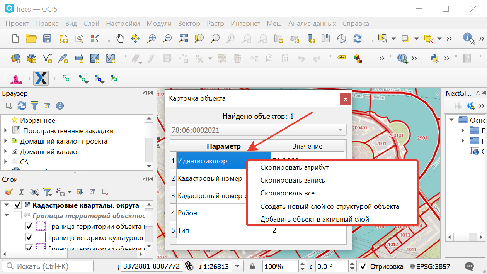
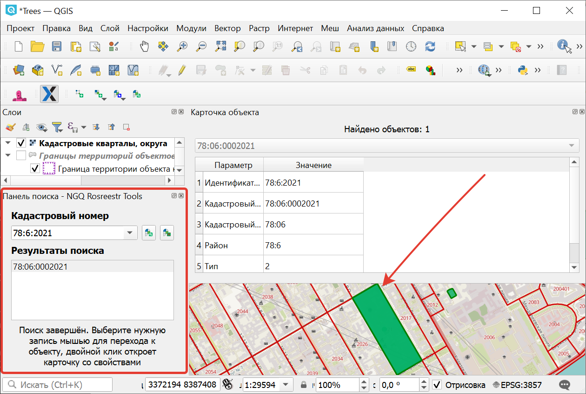

.. sectionauthor:: Роман Гайнуллов <roman.gainullov@nextgis.ru>

.. _ngq_rosreestr_cadaster:

Работа с кадастровой картой
==========================

Подключение кадастрового слоя
-----------------------------

Вторая иконка модуля **NGQ Rosreestr Tools** |icon_add_layers| позволяет добавлять различные слои данных Росреестра (см. :numref:`add_layers_pkk`) из публичной кадастровой карты (далее - ПКК):

* слой кадастровых кварталов, округа
* слой земельных участков, ОКС (Объекты капитального строительства)
* слой зон с особыми условиями использования

   
   Добавление слоёв из ПКК

   
   Слой кадастровых кварталов на карте

Идентификация кварталов и участков
----------------------------------

Третья иконка |identificaion_oicon| позволяет по клику на объект идентифицировать (см. :numref:`identificaion_objects`) атрибутивную информацию по:

* кадастровым кварталам
* земельным участкам
* объектам капитального строительства (ОКС)
* зонам с особыми условиями использования территорий (ЗОУИТ)
* кадастровым округам

   
   Идентификация объектов Росреестра
   

   
   Отображение карточки найденного объекта (ОКС) и подсветка его контура

Если в искомой точке слоя находится несколько объектов (ЗОУИТ например), то можно выбрать нужный из выпадающего списка. При идентификации объект можно сохранить в пользовательский векторный слой, а также создать специальный слой со структурой идентифицируемого объекта. Аналогично при поиске объектов: найденные объекты можно добавлять в пользовательские или специальные векторные слои (см. :numref:`ngq_identification`, :numref:`ngq_temp_layer`).

   
   Доступные опции при идентификации объекта
   
   
.. figure:: _static/ngq_temp_layer.png
   :name: ngq_temp_layer
   :align: center
   :width: 16cm
   
   Добавление объекта во временный пользовательский слой
   
Также можно скопировать запись (строку), значение отдельного атрибута или всю карточку.  

Поиск по кадастровому номеру
----------------------------

Иконка панели поиска |search_icon| позволяет находить объекты из базы данных Росреестра (см. :numref:`search_object`) по кадастровому номеру.

   
   Отображение карточки найденного объекта и подсветка его контура

Процесс поиска объекта по кадастровому номеру можно посмотреть на этом `видео <https://youtu.be/ig6jreu-I9E>`_.

Также доступно подключение кадастровых сервисов для NextGIS Web on-premise для работы на веб-карте.

