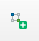
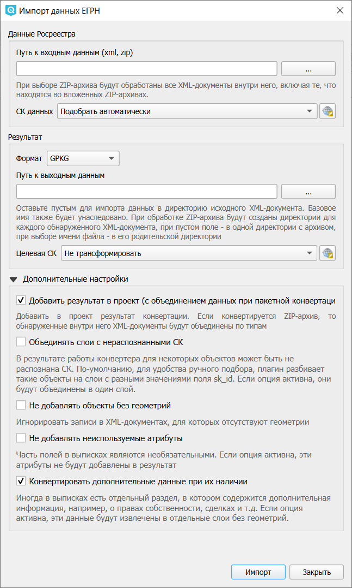
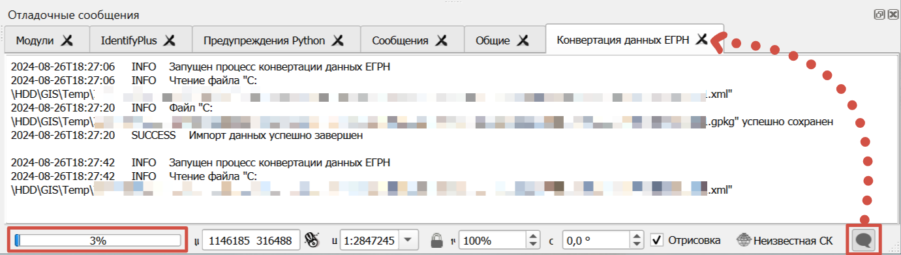
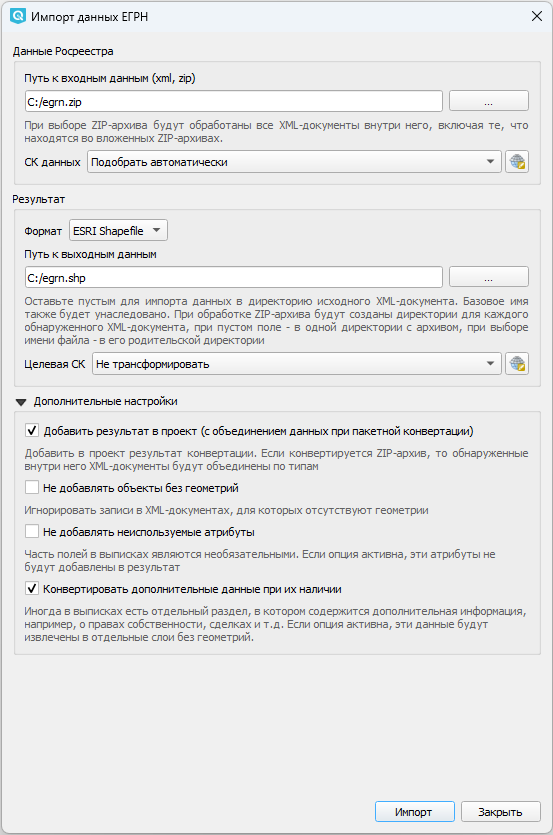
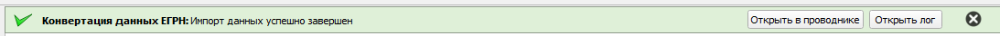
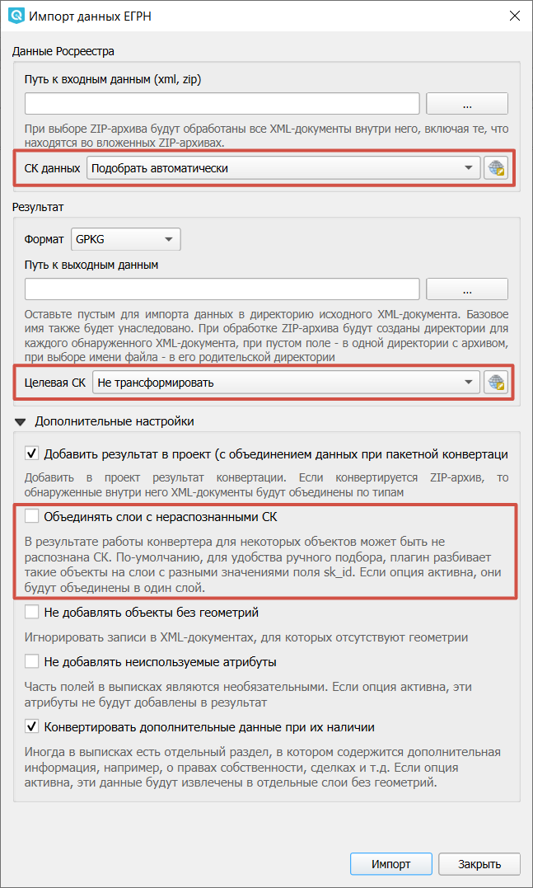
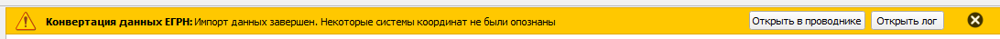

.. sectionauthor:: Роман Гайнуллов <roman.gainullov@nextgis.ru>

.. _ngq_rr_import:

Импорт данных
=============

.. _ngq_rr_import_supported:

Поддерживаемые типы документов ЕГРН
-----------------------------------

Поддерживаемые на данный момент типы документов ЕГРН (список расширяется):

* Кадастровый план территории (КПТ): `KPT_v11, extract_cadastral_plan_territory_v01 <https://rosreestr.gov.ru/upload/Doc/10-upr/extract_cadastral_plan_territory_v01.rar>`_ 
* Кадастровый план территории (КПТ): `KPT_v10 <https://rosreestr.gov.ru/upload/Doc/10-upr/KPT_v10.zip>`_
* Кадастровая выписка о земельном участке (КВЗУ): `KVZU_v07 <https://rosreestr.gov.ru/upload/Doc/10-upr/KVZU_v07.zip>`_
* Кадастровая выписка об объекте капитального строительства (ОКС): `KVOKS_v03 <https://rosreestr.gov.ru/upload/Doc/10-upr/KVOKS_v03.zip>`_ 
* Техплан сооружения: `TP_v06 <https://rosreestr.gov.ru/upload/Doc/10-upr/TP_v06_редакция_4_к10-0783.zip>`_ 
* Выписка о земельном участке: `extract_about_property_land <https://rosreestr.gov.ru/upload/Doc/10-upr/extract_about_property_land_v01.rar>`_ 
* Выписка об объекте недвижимости (сооружении): `extract_about_property_construction <https://rosreestr.gov.ru/upload/Doc/10-upr/extract_about_property_construction_v01.rar>`_ 
* Выписка об объекте недвижимости (здании): `extract_about_property_build <https://rosreestr.gov.ru/upload/Doc/10-upr/extract_about_property_build_v01.rar>`_
* Выписка о характеристиках и правах на земельный участок: `extract_base_params_land <https://rosreestr.gov.ru/upload/Doc/10-upr/extract_base_params_land_v01.rar>`_ 
* Выписка о характеристиках и правах на объект недвижимости (здании): `extract_base_params_build <https://rosreestr.gov.ru/upload/Doc/10-upr/extract_base_params_build_v01.rar>`_ 
* Выписка о базовых параметрах: extract_base_params_const
* Выписка о границах между субъектами РФ, муниципальных образований и населенных пунктов: `extract_about_boundary <https://rosreestr.gov.ru/upload/Doc/10-upr/extract_about_boundaries_v01.rar>`_
* Выписка о ЗОУИТ: `extract_about_zone <https://rosreestr.gov.ru/upload/Doc/10-upr/extract_about_zones_v01.rar>`_
* Местоположения ЗОУИТ: `TerritoryToGKN <https://rosreestr.gov.ru/upload/Doc/10-upr/TerritoryToGKN_v01.rar>`_
* Решение о ЗОУИТ: `ZoneToGKN <https://rosreestr.gov.ru/upload/Doc/10-upr/ZoneToGKN_v05.rar>`_
* также, поддерживается выгрузка секции ReestrExtract с таблицами о правах собственности, сделках и т.п. и аналогичные таблицы в extract_about_property_land.

Если вы столкнулись с ошибкой «Неподдерживаемый тип документа» и необходимой выписки нет в списке поддерживаемых плагином, обратитесь в support@nextgis.ru

.. _ngq_rr_import_process:

Процесс импорта XML
--------------------
Функция импорта выписок из ЕГРН (XML файлы) обозначена следующей иконкой |import_icon| и называется “Импорт данных ЕГРН”. При запуске этого инструмента открывается окно следующего вида (см. :numref:`import-egrn`):

   
   Интерфейс инструмента “Импорт данных ЕГРН”
   
Здесь можно указать настройки импорта (подробнее см. ниже).

Реализована возможность пакетного ввода данных путем обработки ZIP-архива с вложенными в него XML-файлами. При выборе ZIP-архива будут обработаны все XML-документы внутри него, включая те, что находятся во вложенных ZIP-архивах. При пакетной конвертации доступна опция объединения выписок по типам и слоям, и, соответственно, автоматического добавления объединённых слоёв в проект со стилизацией - можно  получить в NGQGIS объединённый слой из сотен выписок. 

Данные Росреестра, как правило, имеют многослойную структуру. В связи с этим при их импорте в форматы .shp, .tab 
и .geojson программе необходимо создать не один набор выходных данных, а несколько. Имена для этих наборов 
будут выбраны автоматически - названия исходных слоёв будут добавлены к имени выходного файла, заданного пользователем. 
Например, если пользователь выбрал формат ESRI Shapefile и указал выходной путь “C:/imported/kpt_12_22.shp”, 
будут созданы файлы “C:/imported/kpt_12_22_lands.shp”, “C:/imported/kpt_12_22_lands_parts.shp” и так далее.

Поле пути для выходных данных можно оставить пустым - тогда импорт будет  произведен в директорию, где расположены входные данные. 

При обработке ZIP-архива будут созданы поддиректории для каждого обнаруженного XML-документа.

В процессе импорта могут быть применены следующие настройки:

* **Добавить результат в проект**. Результаты импорта данных будут добавлены в проект в виде отдельных векторных слоев.
* **Объединять слои с нераспознанными СК**. Если опция включена, объекты, для которых не распознана система координат, будут объединены в один слой. Если отключена, плагин разбивает такие объекты на слои в соответствии со значением поля sk_id.
* **Не добавлять объекты без геометрий**. Если в исходном наборе данных не будет записей о геометрии объекта, то он не будет обработан и не попадет в конечный результат.
* **Не добавлять неиспользуемые атрибуты**. Часть полей в выписках являются необязательными. Если опция активна, эти атрибуты не будут добавлены в результат.
* **Конвертировать дополнительные данные при их наличии**. Дополнительная информация, например о правах собственности, сделках и т.п. будет извлечена в отдельные слои без геометрий.

.. figure:: _static/import_proc2_ru_3.png
   :name: import_proc2
   :align: center
   :width: 14cm
  
   Процесс импорта xml-файла

При старте конвертации окно закроется автоматически. Ход процесса можно видеть в прогрессбаре QGIS, лог конвертации - в окне логов QGIS (открывается кнопкой в правом нижнем углу).

   Логи импорта и прогрессбар текущей конвертации

   
   Процесс импорта zip-архива
   
В случае успешного импорта zip-архива вы увидите соответствующее сообщение.

Если в процессе были получены ошибки, вы будете уведомлены о них в этой же строке состояния. 

"Ошибка записи на диск" - может возникнуть, например, если указан путь к системной директории, доступ к которой возможен только с правами администратора. В таком случае следует сменить место расположение конечного файла.

"Внутренняя ошибка чтения файла" - при возникновении данной ошибки обратитесь в support@nextgis.ru, приложив набор данных и опции, с которыми была запущена конвертация.

"Некоторые системы координат не были опознаны" - см ниже.

.. _ngq_rr_import_srs:

Работа с системами координат
----------------------------

Модуль позволяет указать систему координат (СК) данных и целевую СК. Если не указать СК данных вручную, модуль пытается подобрать их автоматически, но мы не гарантируем, что это будет сделано успешно и с необходимой точностью.
Точные параметры систем координат - собственность Росреестра, не  являются публичной информацией, а в некоторых случаях еще и секретны. Для конвертации модуль использует расчетные, примерные параметры.

   Поля выбора СК данных и целевой СК

В выпадающем меню можно выбрать одну СК из списка. Первой будет стоять СК проекта.

Если нажать на кнопку справа, появится диалоговое окно настройки СК. В нем предствлены три опции:

* Подобрать автоматически (для СК данных) или Не трансформировать (для целевой СК);
* Предустановленные СК - можно выбрать подходящую из каталога;
* Пользовательская СК - параметры можно ввести самостоятельно или скопировать из другой СК.

Слои разбиваются по тому, что написано в поле sk_id. Это можно отключить, если указать "Объединять слои с нераспознанными СК".

Если СК не распознана, то вы можете получить сообщение:
"Импорт данных завершен. Некоторые системы координат не были опознаны".

В этом случае пользователю необходимо: 

* самостоятельно выяснить параметры СК в которой он получил данные;

* добавить эту СК `в QGIS <https://docs.nextgis.ru/docs_ngqgis/source/srs.html#ngq-custom-projections>`_;

* указать новую СК для результатов конвертации.

Как результат, если СК верная, данные "встанут" на место.

