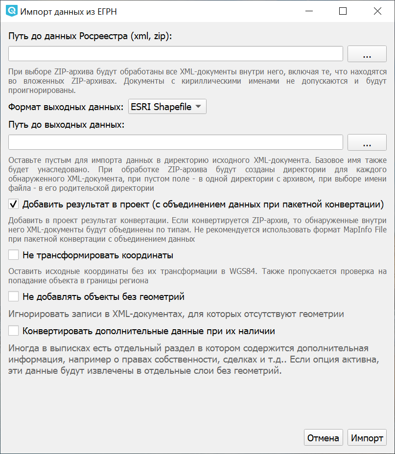
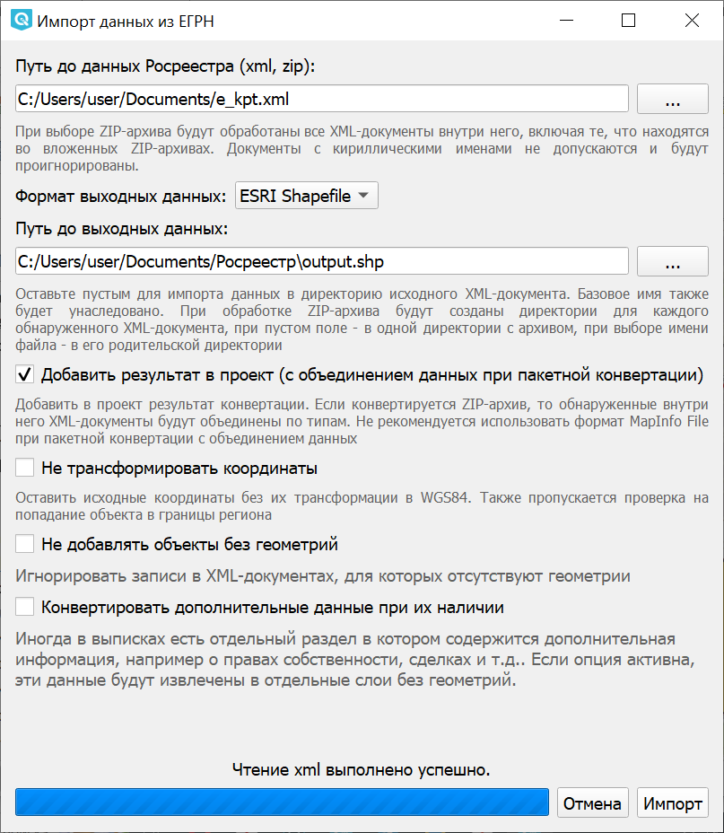
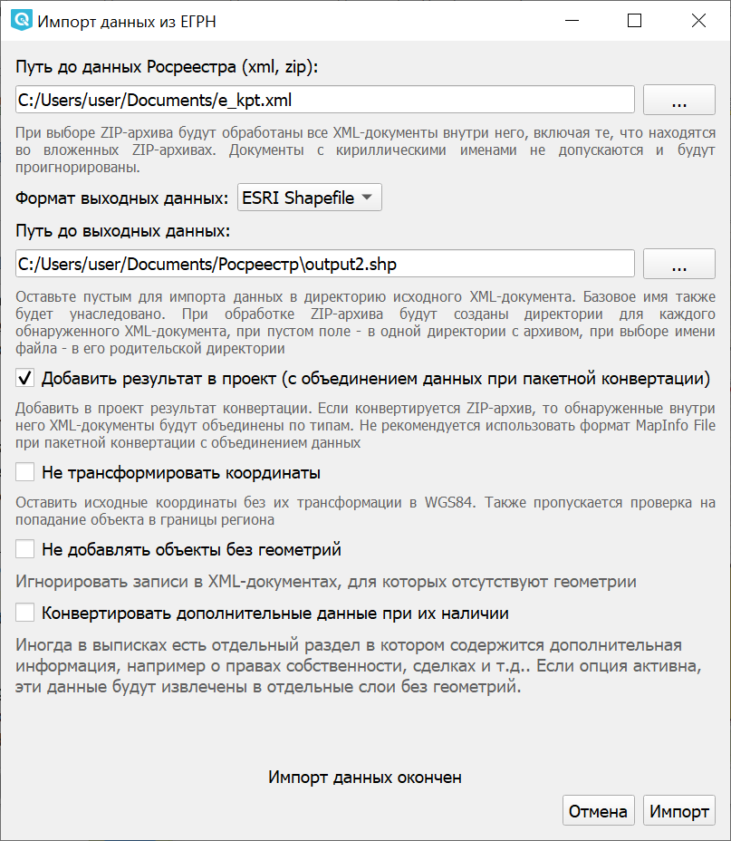
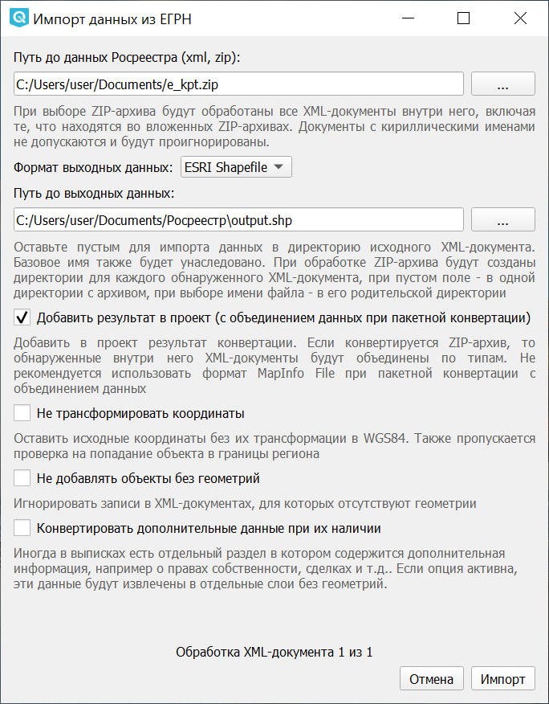
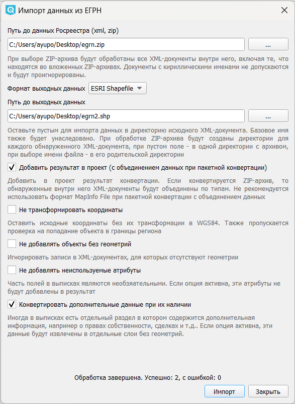

.. sectionauthor:: Роман Гайнуллов <roman.gainullov@nextgis.ru>

.. _ngq_rr_import:

Импорт данных
=============

Поддерживаемые на данный момент форматы данных ЕГРН (список расширяется):

* КПТ: `extract_cadastral_plan_territory_v01 <https://rosreestr.gov.ru/upload/Doc/10-upr/extract_cadastral_plan_territory_v01.rar>`_ 
* КПТ: `KPT_v10 <https://rosreestr.gov.ru/upload/Doc/10-upr/KPT_v10.zip>`_
* КВЗУ: `KVZU_v07 <https://rosreestr.gov.ru/upload/Doc/10-upr/KVZU_v07.zip>`_
* ОКС: `KVOKS_v03 <https://rosreestr.gov.ru/upload/Doc/10-upr/KVOKS_v03.zip>`_ 
* Техплан сооружения: `TP_v06 <https://rosreestr.gov.ru/upload/Doc/10-upr/TP_v06_редакция_4_к10-0783.zip>`_ 
* Выписка о характеристиках и права на земельный участок: `extract_base_params_land <https://rosreestr.gov.ru/upload/Doc/10-upr/extract_base_params_land_v01.rar>`_ 
* Выписка о земельном участке: `extract_about_property_land <https://rosreestr.gov.ru/upload/Doc/10-upr/extract_about_property_land_v01.rar>`_ 
* Выписка о ЗОУИТ: `extract_about_zone <https://rosreestr.gov.ru/upload/Doc/10-upr/extract_about_zones_v01.rar>`_ 
* Местоположения ЗОУИТ: `TerritoryToGKN <https://rosreestr.gov.ru/upload/Doc/10-upr/TerritoryToGKN_v01.rar>`_
* Решение о ЗОУИТ: `ZoneToGKN <https://rosreestr.gov.ru/upload/Doc/10-upr/ZoneToGKN_v05.rar>`_
* также, поддерживается выгрузка секции ReestrExtract с таблицами о правах собственности, сделках и т.п. и аналогичные таблицы в extract_about_property_land.

Функция импорта выписок из ЕГРН (XML файлы) обозначена следующей иконкой |import_icon| и называется “Импорт данных ЕГРН”. При запуске этого инструмента открывается окно следующего вида (см. :numref:`import-egrn`):

.. |import_icon| image:: _static/import_icon_ru.png

   
   Интерфейс инструмента “Импорт данных ЕГРН”
   
В этом интерфейсе предлагается:

* Определить путь до файла XML (или ZIP-архива со вложенными XML-файлами);
* Формат выходных данных из списка (ESRI Shapefile, GPKG, MapInfo File, GeoJSON);
* Задать имя выходного набора;
* Выбрать опцию добавления импортированных файлов в проект;
* Не трансформировать координаты;
* Не добавлять объекты без геометрий.
* Конвертировать дополнительные данные при их наличии.

Реализована возможность пакетного ввода данных путем обработки ZIP-архива с вложенными в него XML-файлами. При выборе ZIP-архива будут обработаны все XML-документы внутри него, включая те, что находятся во вложенных ZIP-архивах. При пакетной конвертации доступна опция объединения выписок по типам и слоям, и, соответственно, автоматического добавления сшитых слоёв в проект со стилизацией - можно  получить в NGQGIS сшитый слой из сотен выписок. Документы с кириллическими именами не допускаются и будут проигнорированы.

Данные Росреестра, как правило, имеют многослойную структуру. В связи с этим при их импорте в форматы .shp, .tab 
и .geojson программе необходимо создать не один набор выходных данных, а несколько. Имена для этих наборов 
будут выбраны автоматически - названия исходных слоёв будут добавлены к имени выходного файла, заданного пользователем. 
Например, если пользователь выбрал формат ESRI Shapefile и указал выходной путь “C:/imported/kpt_12_22.shp”, 
будут созданы файлы “C:/imported/kpt_12_22_parcels.shp”, “C:/imported/kpt_12_22_subparcels.shp” и так далее.

Поле пути для выходных данных можно оставить пустым - тогда импорт будет произведен в директорию исходного XML-документа.
При обработке ZIP-арихва будут созданы директории для каждого обнаруженного XML-документа, при пустом поле - в одной директории с архивом, при выборе имени файла - в его родительской директории.

В процессе импорта могут быть применены следующие настройки:

* **Добавить результат в проект**. Результаты импорта данных будут добавлены в проект в виде отдельных векторных слоев.
* **Не трансформировать координаты**. При выборе данной опции координаты останутся в исходном виде и не будут трансформированы в WGS 84.
* **Не добавлять объекты без геометрий**. Если в исходном наборе данных не будет записей о геометрии объекта, то он не будет обработан и не попадет в конечный результат.
* **Конвертировать дополнительные данные при их наличии**. Дополнительная информация, например о правах собственности, сделках и т.п. будет извлечена в отдельные слои без геометрий.

Строка состояния в нижней части интерфейса будет информировать вас о ходе импорта. 
 

   

   
   Процесс импорта xml-файла

По завершении импорта xml-файла окно закроется автоматически.

   

   
   Процесс импорта zip-архива
   
В случае успешного импорта zip-архива вы увидите сообщение “Обработка завершена”.

Если в процессе были получены ошибки, вы будете уведомлены о них в этой же строке состояния. 
Вы также можете получить следующее сообщение: *“Импорт данных окончен. Важно: система координат не была опознана, 
данные сохранены в исходных координатах без метаданных.”* Это значит, что система координат в исходных данных Росреестра 
не была опознана программным обеспечением: скорее всего, параметров целевой системы координат нет в базе данных. 
База данных систем координат постоянно пополняется.
