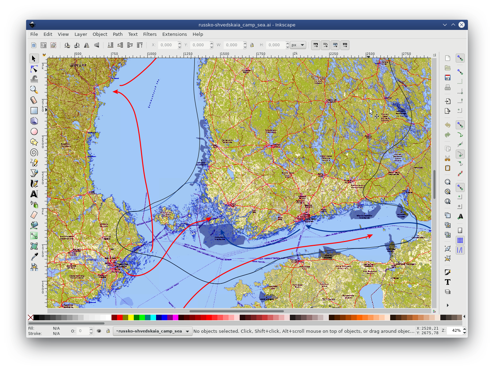
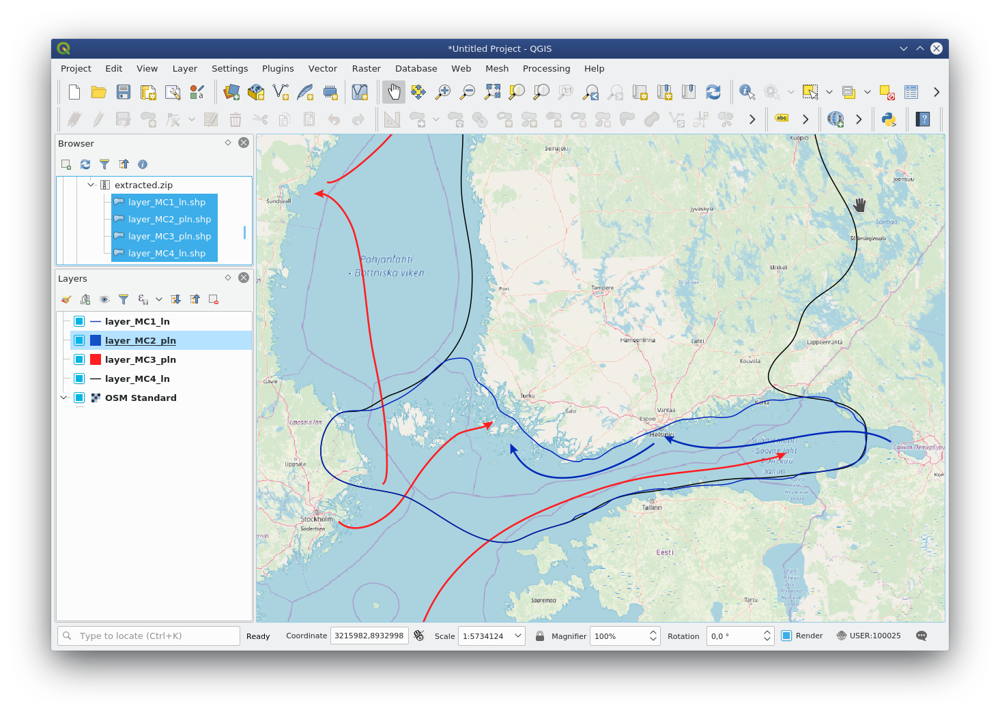

Геоданные из файлов Adobe Illustrator
=============================================

Инструмент извлекает слои векторных данных из файла Adobe Illustrator (\*.ai). Можно использовать дополнительный растровый файл для геопривязки.

На входе:

* Файл Adobe Illustrator (с расширением .ai), в котором содержатся векторные объекты. 
* Растровый файл для геопривязки - файл GeoTIFF (с расширением .geotiff или .tif) или ZIP-архив с PNG + PGW (world-файл). Эти же файлы должны использоваться в файле AI в качестве подложки. Данное поле опционально, если оставить его пустым, векторные слои будут в относительной системе координат.

На выходе:

* ZIP-архив, содержащий набор векторных файлов в формате ESRI Shapefile.

Запуск инструмента: https://toolbox.nextgis.com/operation/ai2geo

   
   Исходные векторные данные в .ai файле.

   
   Результат работы инструмента: полученные слои загружены в QGIS и отображаются на фоне подложки OSM.

**Попробуйте инструмент в действии, скачав наш пример:**

`Набор исходных данных <https://nextgis.ru/data/toolbox/ai2geo/ai2geo_inputs_ru.zip>`_ для проверки работы инструмента. Внутри архива пошаговая инструкция.

`Пример результата <https://nextgis.ru/data/toolbox/ai2geo/ai2geo_outputs_ru.zip>`_ работы инструмента.
