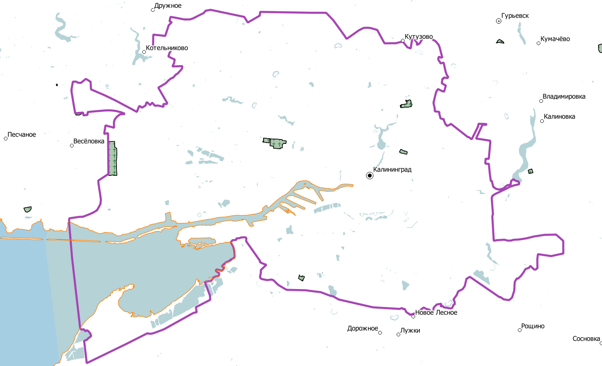
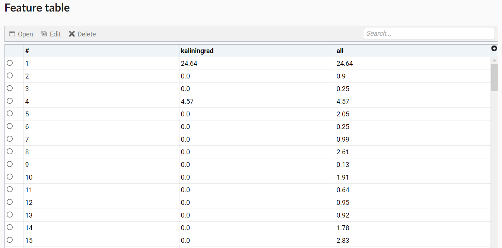
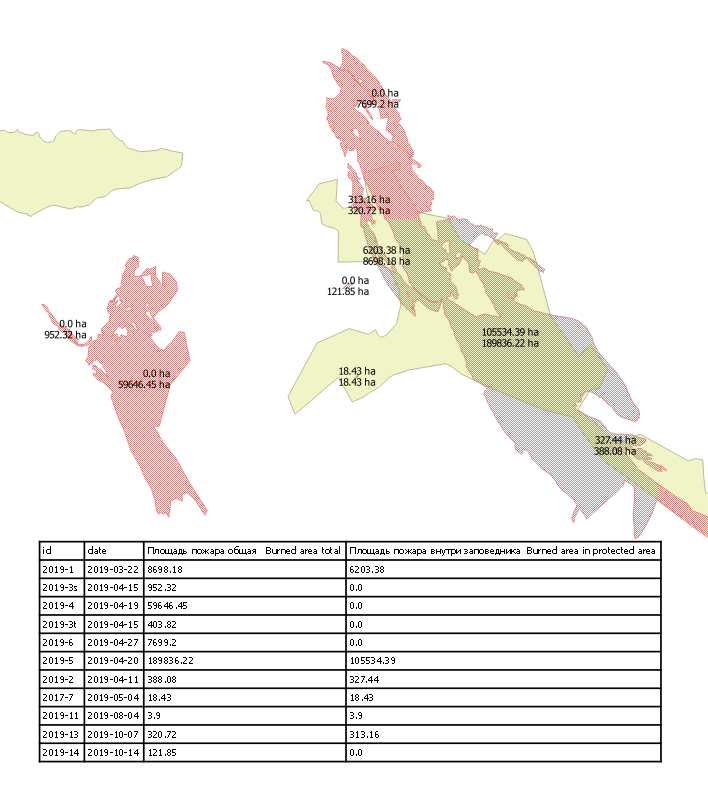

Площади пересечений вне/внутри границ
=====================================

Инструмент позволяет вычислить площади полигонов вне и внутри заданной границы. Инструмент был создан для подсчёта площади степных пожаров в заповедниках, для каждого полигона (территории отдельного пожара) расчитывает его площадь, и площадь попадающую в территорию заповедника. Инструмент использует слои лежащие в nextgisweb. 
Значения площадей рассчитываются в гектарах (ha). Инструмент корректно работает с данными находящимися в любом месте земли, и не зависит от зон UTM.

На входе:

*  Адрес Веб ГИС - указывается URL Веб ГИС, которая содержит векторные слои.
*  Слой с полигонами - номер ресурса в Веб ГИС (векторный слой), для объектов которого будет рассчитана площадь. Например, 443.
*  Слой с границей - номер ресурса в Веб ГИС (векторный слой), по которому будет задана граница; слой должен содержать один полигон. Например, 445.
*  Поле для общей площади полигона - название колонки атрибутов в слое с полигонами, куда будет записана площадь каждого полигона. Название должно быть на латинице. Тип поля - String.
*  Логин для Веб ГИС
*  Пароль для Веб ГИС
*  Поле для площади полигона внутри границы - название колонки атрибутов в слое с полигонами, куда будет записана площадь полигонов, оказавшихся внутри заданной границы. Площадь полигонов, оказавшихся вне границы, будет указана как равная 0. Название атрибута должно быть на латинице. Тип поля - String.

На выходе

*  Рассчитанная площадь полигонов, внесенная в соответствующие колонки атрибутов в слое с полигонами.

   
   Пример исходных данных
   

   
   Пример результата работы инструмента

`Видео <https://youtu.be/w8ONg0bgqcQ?si=ITzcPPd2PCPvQZBL>`_

Запуск инструмента: https://toolbox.nextgis.com/operation/clip_polys_poly

   
   Пример загруженного в QGIS результата работы инструмента, с добавленым вручную оформлением
   
**Попробуйте инструмент в действии, скачав наш пример:**

`Набор исходных данных <https://nextgis.ru/data/toolbox/clip_polys_poly/clip_polys_poly_inputs_ru.zip>`_ для проверки работы инструмента. Внутри архива пошаговая инструкция.

