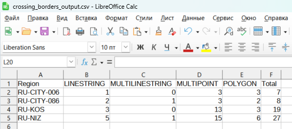

Подсчёт пересечений с полигональными слоями
===========================================

Инструмент находит количество пересечений между двумя наборами векторных слоев, один из которых - строго набор полигонов.  Иными словами, будет подсчитано, сколько объектов попало в заданную полигонами область интереса. На выходе - файл CSV со статистикой по каждому полигону.

На входе:

* Область интереса - задается одним или несколькими файлами GeoJSON, упакованными в ZIP-архив. Каждый файл GeoJSON может содержать только 1 полигон. Имена файлов попадут в итоговую таблицу CSV.
* Объекты - один или несколько векторных слоев с любым типом геометрии (может различаться между слоями) в формате Esri Shapefile или GeoPackage. Слой или слои должны быть упакованы в общий ZIP-архив.
* Группировка по слоям - опциональное поле. Если галочка проставлена, то данные в отчете будут сгруппированы по слоям, к которым относятся объекты. В противном случае - по типу геометрий объектов. 
* Отдельная запись - опциональное поле. Если галочка проставлена, то для значений по каждой категории (слои или тип геометрии, в зависимости от выбора выше) в отчете будет сформирована отдельная запись.

На выходе:

* CSV-файл, содержащий информацию по каждому полигону: сколько объектов и с каким типом геометрии попало в границы полигона. 

   Итоговый файл CSV

Запуск инструмента: https://toolbox.nextgis.com/operation/crossing_borders

**Попробуйте инструмент в действии, скачав наш пример:**

`Набор исходных данных <https://nextgis.ru/data/toolbox/crossing_borders/crossing_borders_inputs_ru.zip>`_ для проверки работы инструмента. Внутри архива пошаговая инструкция.

`Пример результата <https://nextgis.ru/data/toolbox/crossing_borders/crossing_borders_outputs_ru.zip>`_ работы инструмента.
