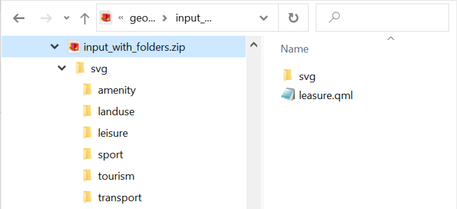

Добавление SVG в QGS/QML
==========================
Инструмент добавляет и записывает SVG маркеры в файл проекта QGS или файл стиля QML.

В интерфейсе qgis можно записывать маркеры в файл проекта только по одному, что отнимает много времени. Этот инструмент позволяет включить сразу все маркеры в файл. Можно сделать это для всего проекта целиком или для отдельного стиля, если работа идёт на уровне одного слоя.

**На входе:**

ZIP-архив, который содержит:

* файлы SVG 
* файл проекта QGS или файл стиля QML, в который надо добавить векторные маркеры SVG.

Архив должен быть структурирован одним из двух способов.

1. Файлы SVG-маркеров сложены в папки, повторяющие путь к файлу на компьютере, например: полный путь к маркеру, который сохранён в QML-файле стиля: C:/HDD/GIS/DataExamples/geojson-example/svg/leisure/fishing.svg. Тогда структура архива будет выглядеть следующим образом:

   Структура архива, загружаемого для обработки

.. note::
  Рекомендуем даже при обработке отдельного стиля слоя включать в архив целиком папку, содержащую SVG-маркеры проекта, со всеми подпапками.

2. Файлы SVG-маркеров сложены в корень архива вместе с файлом стиля/проекта, без подпапок. Этот способ пригодится, если маркеры на устройстве были сохранены отдельно от проекта.

**На выходе:**

ZIP-архив с обновленным файлом проекта QGS или файлом стиля QML (в зависимости от того, какой файл был подан на вход).

Запуск инструмента: https://toolbox.nextgis.com/operation/embedsvg

**Попробуйте инструмент в действии, скачав наш пример:**

`Набор исходных данных <https://nextgis.ru/data/toolbox/embedsvg/embedsvg_inputs_ru.zip>`_ для проверки работы инструмента. Внутри архива пошаговая инструкция.

`Пример результата <https://nextgis.ru/data/toolbox/embedsvg/embedsvg_outputs_ru.zip>`_ работы инструмента.
