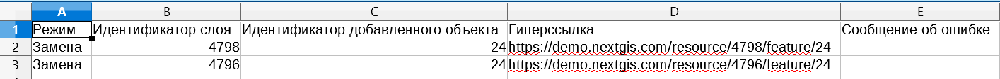

Изменение геометрии в группе слоев
==================================

Инструмент изменяет геометрию объектов в группе слоев ресурса Веб ГИС. Изменение возможно в 3 режимах: Удаление, Вставка, Замена.
В режиме удаления инструмент удаляет выбранные объекты. Выбор производится на основе заданных значений атрибутивного поля слоя.
в режиме вставки инструмент добавляет новые объекты из загружаемого shp-файла, при этом структура файла и слоя должна совпадать. В противном случае, инструмент не сможет добавить новые объекты.
В режиме замены инструмент заменяет значение геометрии для объектов из загружаемого shp-файла, значения заданного атрибута которых совпадают со значениями атрибута слоя Веб ГИС. Название атрибута в shp-файле и слое Веб ГИС должны совпадать.

На входе:

* Адрес Веб гис - url-адрес вашей Веб ГИС (например, http(s)://mywebgis.nextgis.com)
* Логин - Имя пользователя, имеющего права на запись данных в указанный ресурс
* Пароль - Пароль пользователя в Веб ГИС
* Идентификатор группы ресурса - Идентификатор ресурса Веб ГИС, в котором содержится группа слоев
* Исходное поле - Имя исходного поля, по которому производится поиск объектов
* Режим - Тип режима изменения геометрии объектов. Для удаления объектов выберите режим Delete, для добавления - Add, для замены - Change
* Исходное значение - Значение поля, по которому осуществляется выбор объектов. Если необходимо указать несколько значений, используйте запятую в качестве разделителя. Параметр необходим в режимах Delete и Change
* Год начала - Начало временного диапазона (опциональный параметр)
* Год окончания - Окончание временного диапазона (опциональный параметр)
* SHP-файл - Файл в формате ESRI Shapefile (в виде ZIP-фрхива), который содержит объекты. Параметр обязательный в режимах Add и Change

.. note::
    Год начала и год окончания - необязательные параметры. Данные параметры позволяют ограничить временной диапазон для выбранных слоев. Для использования этих параметров необходимо убедиться, что в названиях слоев ресурса Веб ГИС указаны временные диапазоны. Например, в слое 1245_1246_rus_earl_v.1.0 1245 и 1246 указывают на время. Если данные параметры используются, то необходимо ввести трех- или четырехзначные значения.  Остальные поля являются **обязательными**.

На выходе:

*  CSV файл, в котором представлены данные о выбранном режиме, исходном поле и его значение, перечень гиперссылок на объекты, которые были изменены, в случае возникновения ошибок, они будут также указаны в данном файле.

   Пример результата работы инструмента

Запуск инструмента: https://toolbox.nextgis.com/operation/geometry_changer

**Попробуйте инструмент в действии, скачав наш пример:**

`Набор исходных данных <https://nextgis.ru/data/toolbox/geometry_changer/geometry_changer_inputs_ru.zip>`_ для проверки работы инструмента. Внутри архива пошаговая инструкция.

`Пример результата <https://nextgis.ru/data/toolbox/geometry_changer/geometry_changer_outputs_ru.zip>`_ работы инструмента.
