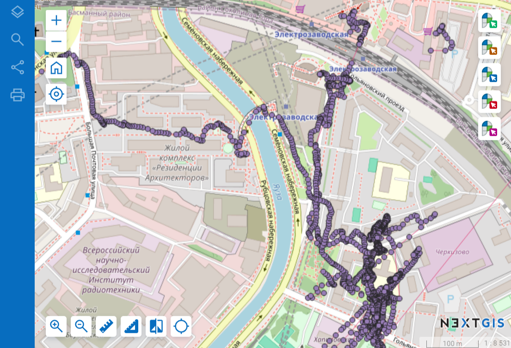

.. sectionauthor:: Юлия Григоренко <grigorenko.j@gmail.com>

Объединение GPX файлов 
========================

Объединяет GPS треки в формате GPX в один. Большинство программ открывает треки по одному, и с помощью этого инструмента нет необходимости выяснять, в какую дату был записан трек нужного места, можно открыть все собранные данные сразу.

   Множество треков единым слоем на карте

Кроме того, некоторые программы и устройства при выключении питания оставляют GPX без закрывающих тегов, и  многие программы такие файлы не открывает. Этот инструмент позволяет починить такие файлы.

.. figure:: _static/gpxmerge_missing_tags_en.png
   :name: gpxmerge_missing_tags_pic
   :align: center
   :width: 14cm

   Конец файла GPX с закрывающими тэгами и без них

На входе: ZIP архив с GPX файлами.

* В архиве могут быть многократно вложенные папки.

.. important::
	Архивы внутри архива не поддерживаются. 

* Файлы в разных папках внутри архива могут называться одинаково, инструмент их примет.

На выходе: файл GPX.

Запуск инструмента: https://toolbox.nextgis.com/operation/gpxmerge

**Попробуйте инструмент в действии, скачав наш пример:**

`Набор исходных данных <https://nextgis.ru/data/toolbox/gpxmerge/gpxmerge_inputs_ru.zip>`_ для проверки работы инструмента. Внутри архива пошаговая инструкция.

`Пример результата <https://nextgis.ru/data/toolbox/gpxmerge/gpxmerge_outputs_ru.zip>`_ работы инструмента.
