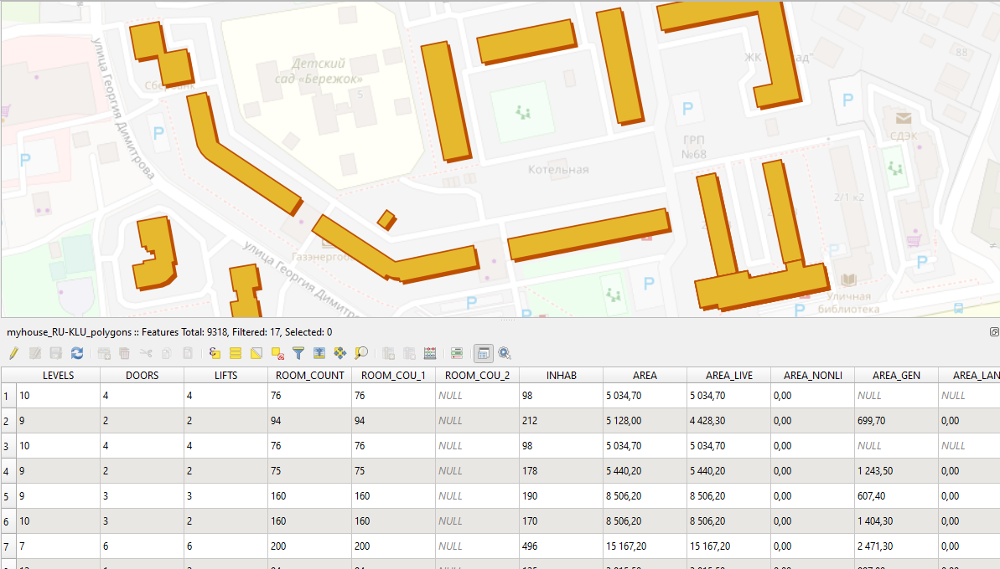

Объединение OSM и РеформыЖКХ
============================

Объединение данных OpenStreetMap и выгрузки РеформыЖКХ для получения полигонального слоя зданий со всеми атрибутами из РеформыЖКХ.

   
   Данные РеформыЖКХ объединённые с OpenStreetMap.
   
На входе:

* Полигональный слой зданий из OSM, архив ZIP
* Точечный слой зданий из РеформыЖКХ, файл CSV

На выходе:

Архив содержащий:

* Слой полигонов к которым были найдены соответствующие точки из РеформыЖКХ.
* Слой остальные точки, к которым не были найдены полигоны в OpenStreetMap.
* Исходные данные, файл CSV

Запуск инструмента: https://toolbox.nextgis.com/operation/joinreforma

**Попробуйте инструмент в действии, скачав наш пример:**

`Набор исходных данных <https://nextgis.ru/data/toolbox/joinreforma/joinreforma_inputs_ru.zip>`_ для проверки работы инструмента. Внутри архива пошаговая инструкция.

`Пример результата <https://nextgis.ru/data/toolbox/joinreforma/joinreforma_outputs_ru.zip>`_ работы инструмента.
