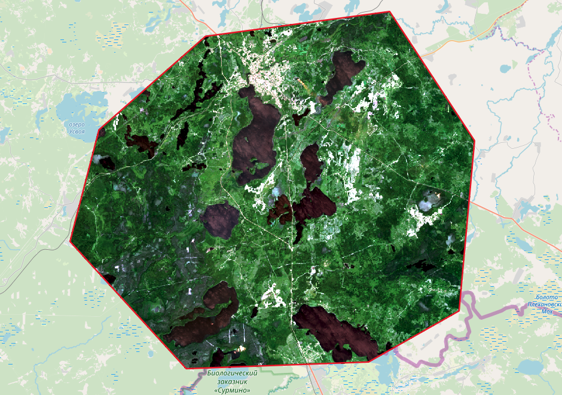

Подготовить растр
=================

Инструмент, который осуществляет поканальную склейку набора одноканальных растров и обрезку склеенного растра по векторной маске.

На входе:

* Исходные растровые данные

Исходные растровые данные могут быть представлены в двух видах:

1. многоканальный растр в GDAL-совместимом формате

2. ZIP архив с набором одноканальных GDAL-совместимых растров.

* Векторный слой, используемый в качестве маски

ZIP-архив с ESRI Shapefile или отдельный файл формата поддерживаемого OGR.

* Значение "Нет данных"

Значение, которое будет помечено как Нет данных. Используйте символ - для использования значения по умолчанию

* Название результирующего растра

Без расширения файла (например ndvi, water). Расширение будет автоматически установлено в .tif

Если на входе архив с одноканальными растрами, инструмент сначала объединяет их в многоканальный растр. Порядок каналов определяется алфавитной сортировкой имён исходных растров в архиве.
Затем многоканальный растр (собранный из архива или поданный на вход сразу) обрезается по векторной маске.

Исходные растры и векторная маска могут быть в разных системах координат, перед началом обработки все данные приводятся в единый пространственный домен.

Запуск инструмента: https://toolbox.nextgis.com/operation/prepare_raster

   Пример результата работы инструмента

**Попробуйте инструмент в действии, скачав наш пример:**

`Набор исходных данных <https://nextgis.ru/data/toolbox/prepare_raster/prepare_raster_inputs_ru.zip>`_ для проверки работы инструмента. Внутри архива пошаговая инструкция.

`Пример результата <https://nextgis.ru/data/toolbox/prepare_raster/prepare_raster_outputs_ru.zip>`_ работы инструмента.
