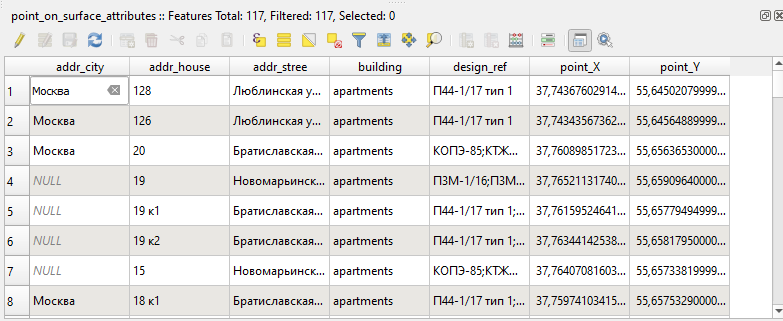

Координаты точки в полигоне
============================

Расчет координат точки гарантировано находящейся внутри полигона и добавление этих координат в атрибуты point_X, point_Y. Метод PointOnSurface. Работает только с полигонами.

На входе:

* Полигональный слой - векторный слой в одном из поддерживаемых GDAL форматов, например, Shapefile в ZIP-архиве, GeoJSON, GeoPackage.

На выходе:

* ZIP-архив с shp-файлом слоя полигонов, содержащим два новых поля point_X, point_Y 
* Файл стиля .qml

.. figure:: _static/point_on_surface.png
   :align: center
   :width: 16cm

   

   

Запуск инструмента: https://toolbox.nextgis.com/operation/centroid2attr

**Попробуйте инструмент в действии, скачав наш пример:**

`Набор исходных данных <https://nextgis.ru/data/toolbox/centroid2attr/centroid2attr_inputs_ru.zip>`_ для проверки работы инструмента. Внутри архива пошаговая инструкция.

`Пример результата <https://nextgis.ru/data/toolbox/centroid2attr/centroid2attr_outputs_ru.zip>`_ работы инструмента.

