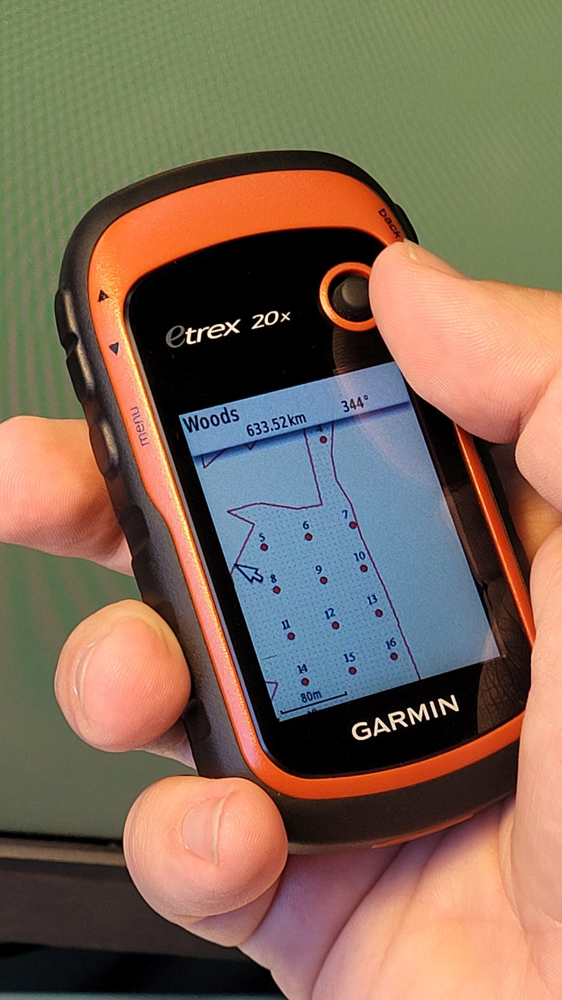

Создание схемы круговых площадок для Garmin
===========================================

Инструмент создаёт схемы круговых площадок в формате KMZ, предназначенном для загрузки в навигаторы GARMIN. Площадки, лежащие ближе чем 10 м от границы отвода - отбрасываются. Вокруг отвода добавляется буферная зона на расстоянии 50 м.

На входе:

*  Полигональный слой, содержащий полигон отвода. ZIP-архив с ESRI Shapefile, Mapinfo TAB или отдельный файл формата, поддерживаемого OGR. Полигон должен быть один и не должен содержать дырки.
*  Расстояние между точками - расстояние в метрах между площадками. По умолчанию: 55 метров.

На выходе:

* Файл KMZ со схемой круговых площадок, пригодный для загрузки в Garmin.
* Схема круговых площадок в формате JPG отдельным файлом.

Запуск инструмента: https://toolbox.nextgis.com/operation/forestplots_field

   
   Пример результата работы инструмента, загруженный в Garmin
   
**Попробуйте инструмент в действии, скачав наш пример:**

`Набор исходных данных <https://nextgis.ru/data/toolbox/forestplots_field/forestplots_field_inputs_ru.zip>`_ для проверки работы инструмента. Внутри архива пошаговая инструкция.

`Пример результата <https://nextgis.ru/data/toolbox/forestplots_field/forestplots_field_outputs_ru.zip>`_ работы инструмента.
