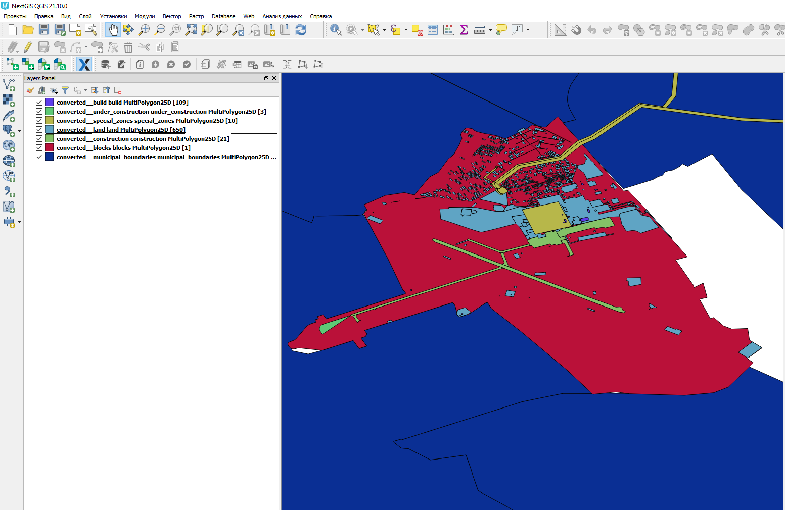

Конвертация данных ЕГРН
=======================

   Результирующие данные

Конвертация выписок ЕГРН в геоданные. Поддерживаемые форматы данных ЕГРН: https://docs.nextgis.ru/docs_rosreestr_tools/source/rr-import.html#id2

На входе:

*  Исходный набор данных - XML-документ с выпиской или ZIP-архив с набором выписок. Поддерживаются вложенные архивы. Максимальный размер XML-файла или совокупности нескольких файлов - 100 мб. Если необходимо конвертировать больший по размеру файл, пожалуйста, воспользуйтесь модулем `NGQ Rosreestr Tools <https://docs.nextgis.ru/docs_rosreestr_tools/source/toc.html>`_ в настольной программе NextGIS QGIS.
*  Формат выходных данных - GPKG, GeoJSON, ESRI Shapefile или MapInfo File. Если оставить поле пустым, используется GPKG.
*  Идентификатор выходных данных - Название для использования в именах выходных файлов. Если оставить поле пустым, используется converted.
*  Объединять наборы данных - При конвертации нескольких файлов XML слои из разных файлов, но с одинаковым типом объектов будут объединены в один общий слой (исходные результаты конвертации также сохранятся). Не рекомендуется использовать с форматом MapInfo File.
*  Не менять систему координат - Оставить объекты в исходной системе координат без их трансформации в WGS84.
*  Пропускать объекты без геометрии - Игнорировать записи в XML-документах, для которых отсутствуют геометрии (координаты).
*  Удалять пустые атрибуты - Атрибуты, не содержащие информацию ни по одному объекту, будут целиком удалены из слоя.
*  Конвертировать доп. данные - Иногда к выпискам присоединен отдельный раздел ReestrExtract, в котором содержится дополнительная информация. Например, о правах собственности на объекты. Если опция включена, эти данные будут добавлены в отдельные слои без геометрий.

На выходе:

* ZIP архив с результатами конвертации. 

`Видео <https://youtu.be/UbrepJSZpUQ?si=m41teMbdnMIt7Uzh>`_

Запуск инструмента: https://toolbox.nextgis.com/operation/import_egrn

**Попробуйте инструмент в действии, скачав наш пример:**

`Набор исходных данных <https://nextgis.ru/data/toolbox/import_egrn/import_egrn_inputs_ru.zip>`_ для проверки работы инструмента. Внутри архива пошаговая инструкция.

`Пример результата <https://nextgis.ru/data/toolbox/import_egrn/import_egrn_outputs_ru.zip>`_ работы инструмента.

Для конвертации и других операций с кадастровыми данными вы также можете использовать конвертер Rosreestr Tools https://docs.nextgis.ru/docs_ngqgis/source/NGQ_Rosreestr_Tools.html
