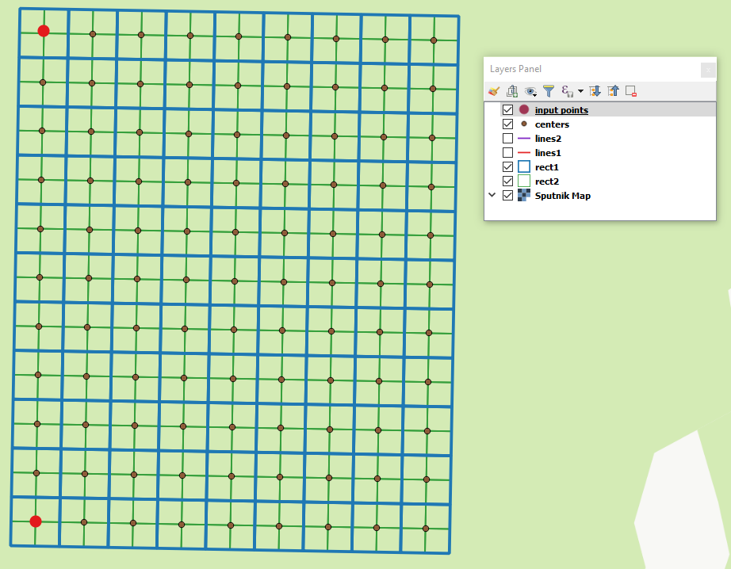

Генератор набора квадратов
==========================

Этот инструмент cоздает набор сеток квадратов (полигоны) и трансект их обхода для заданной территории.

На входе:

* x0 - Долгота точки 0
* y0 - Широта точки 0
* x1 - Долгота точки 1
* y1 - Широта точки 1
* Размер 1 - Количество ячеек по первой оси
* Размер 2 - Количество ячеек по второй оси
* Сторона отсчета - Сторона генерации ячеек (right,left)
* Размер ячейки - Размер стороны ячейки, метров

Алгоритм расчета: от точки 0 в направлении точки 1 прокладывается линия длиной, равной "Размер 1" * "Размер ячейки". От этой линии либо направо либо налево от нее откладывается вторая линия длиной "Размер 2" * "Размер ячейки", метров. Две эти линии формируют сетку квадратов.

Результатом работы процесса является набор слоёв:

* rect1 - сеть ячеек размером "Размер 1" * "Размер 2" ячеек, центр первой ячейки - в точке 0
* rect2 - сеть уменьшенных ячеек размером "Размер 1" * "Размер 2" ячеек (т.е. в 4 раза больше ячеек, каждая крупная ячейка разделена на 4 части)
* line1 - линии обхода в направлении, перпендикулярном линии, представленной точкой 0 и точкой 1
* line2 - линии обхода в направлении, параллельном линии, представленной точкой 0 и точкой 1
* centers - центры ячеек сетки rect1

Запуск инструмента: https://toolbox.nextgis.com/operation/quadro

   
   Пример результата работы инструмента 

**Попробуйте инструмент в действии, скачав наш пример:**

`Набор исходных данных <https://nextgis.ru/data/toolbox/quadro/quadro_inputs_ru.zip>`_ для проверки работы инструмента. Внутри архива пошаговая инструкция.

`Пример результата <https://nextgis.ru/data/toolbox/quadro/quadro_outputs_ru.zip>`_ работы инструмента.
