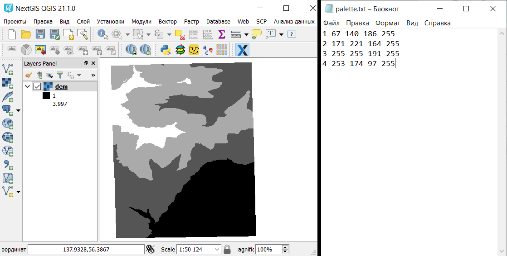
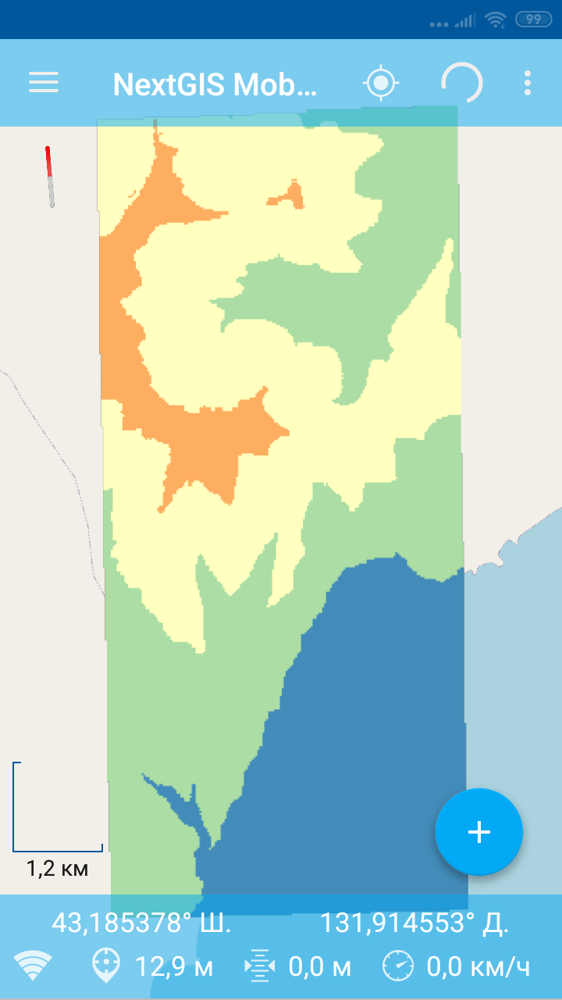

Создание тайлового набора по растру
===================================

Инструмент создает тайлы в формате NGM (.ngrc) на основе gdal-совместимого набора растровых геоданных.

На входе:

*  Файл с палитрой - текстовый файл (расширение .txt), в котором описание цвета (формат RGBA) каждого значения растра занимает отдельную строку. Порядок записи: Значение Красный Зеленый Синий Прозрачность. Например, для значения 23 присвоение абсолютно непрозрачного сиреневого цвета выглядит так: 23 200 162 200 255. Прозрачность находится в пределах от 0 до 255, 0 - абсолютно прозрачный, 255 - абсолютно непрозрачный.  Используйте пустой текстовый файл, чтобы оставить исходную палитру (для одноканальных с палитрой) и для RGB/RGBA растров
*  Исходный растр - RGB, RGBA, одноканальный серый или одноканальный с палитрой GDAL-совместимый растр
*  Название тайлового набора - название набора тайлов, которое будет использовано для имени файла и для слоя в NGM
*  Масштабные уровни - уровни, на которых будут отображаться тайлы. Имеются в виду `стандартные уровни зумирования <https://wiki.openstreetmap.org/wiki/Zoom_levels>`_, например, как для карт OSM. Возможные вносимые значения: число, обозначающее один уровень, например, 10; диапазон уровней, например, 8-14; знак дефиса - для автоподбора уровней

На выходе

*  файл .ngrc с тайловым набором

   
   Пример исходных данных
   

   
   Пример результата работы инструмента - файл .ngrc, добавленный в NextGIS Mobile

Запуск инструмента: https://toolbox.nextgis.com/operation/raster2tiles

**Попробуйте инструмент в действии, скачав наш пример:**

`Набор исходных данных <https://nextgis.ru/data/toolbox/raster2tiles/raster2tiles_inputs_ru.zip>`_ для проверки работы инструмента. Внутри архива пошаговая инструкция.

`Пример результата <https://nextgis.ru/data/toolbox/raster2tiles/raster2tiles_outputs_ru.zip>`_ работы инструмента.
