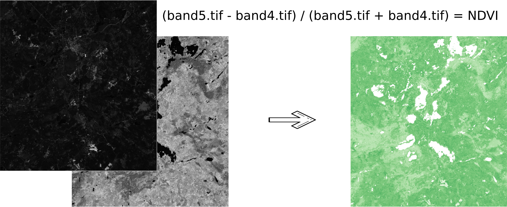

Калькулятор растров (GDAL)
===========================

   
   
Инструмент, реализующий растровую арифметику для многоканальных растров или групп одноканальных растров. Использует скрипт `gdal_calc.py <https://gdal.org/programs/gdal_calc.html>`_.

На входе:

* Исходные растровые данные.

Исходные растровые данные могут быть представлены в двух видах:

1. многоканальный растр в GDAL-совместимом формате

2. ZIP архив с набором одноканальных GDAL-совместимых растров.

Растры в архиве могут храниться в разных системах координат, иметь разные охваты и размеры ячеек. При расчёте всё будет приведено в единый пространственный домен.

* Выражение.

Стандартное выражение с использованием операторов +, -, \*, /, >, < и т.п. Если исходные данные - ZIP архив, то следует использовать имена исходных файлов в выражении (например band4.tif / band5.tif, если файлы имеют соответствуюшие имена). Расширение является частью имени.
Для мультиканального растра следует использовать номер канала с префиксом & (например &4 / &5). Каналы нумеруются начиная с 1.

Примеры выражений:

Участки леса с температурой меньше 30 градусов:

forest_mask.tif * (land_temperature.tif < 30)

Индекс EVI:

2.5 * (&5 - &4) / (&5 + 6.0*&4 - 7.5*&2 + 1.0)

* Название результирующего растра

Без расширения файла (например ndvi, water). Расширение будет автоматически установлено в .tif

* Разрешение по X

Ширина каждого отдельного пикселя в результирующем растре в метрике системы координат первого растра из набора (напр. 30). Используйте символ - для автоматического подбора ширины пикселя

* Разрешение по Y

Высота каждого отдельного пикселя в результирующем растре в метрике системы координат первого растра из набора (напр. 30). Используйте символ - для автоматического подбора высоты пикселя

* Охват результирующего растра

Формат: xmin, ymin, xmax, ymax. Пример: 1000, 1000, 2500, 2500. Используйте - для автоматического определения охвата. В таком случае будет рассчитан охват пересечений всех входных растров

* Тип данных для нового растра

Доступные типы данных: Int32, Int16, Float64, UInt16, Byte, UInt32, Float32. Используйте - для автоматического подбора типа данных

Результатом работы процесса является одноканальный растр в формате GeoTiff, расчитанный в соответствии с заданным выражением.

Если пользователь задаёт один из опциональных параметров (разрешение по одной из осей или охват), то сначала все участвующие в выражении растры приводятся к заданному состоянию, затем производится расчёт. В случае автоматического подбора параметров пространственного домена используется следующая логика:

1. Вычисляется наименьшее пространственное разрешение среди всех исходных растров. Оно принимается за выходное.

2. Все растры перепроецируются в систему координат первого растра в списке.

3. Выходной охват вычисляется как охват пересечений всех исходных растров.

`Видео <https://youtu.be/ItkjxjZ7aw0?si=kAr4pCg3Pp_oF6Pr>`_

Запуск инструмента: https://toolbox.nextgis.com/operation/raster_calculator

**Попробуйте инструмент в действии, скачав наш пример:**

`Набор исходных данных <https://nextgis.ru/data/toolbox/raster_calculator/raster_calculator_inputs_ru.zip>`_ для проверки работы инструмента. Внутри архива пошаговая инструкция.

`Пример результата <https://nextgis.ru/data/toolbox/raster_calculator/raster_calculator_outputs_ru.zip>`_ работы инструмента.

