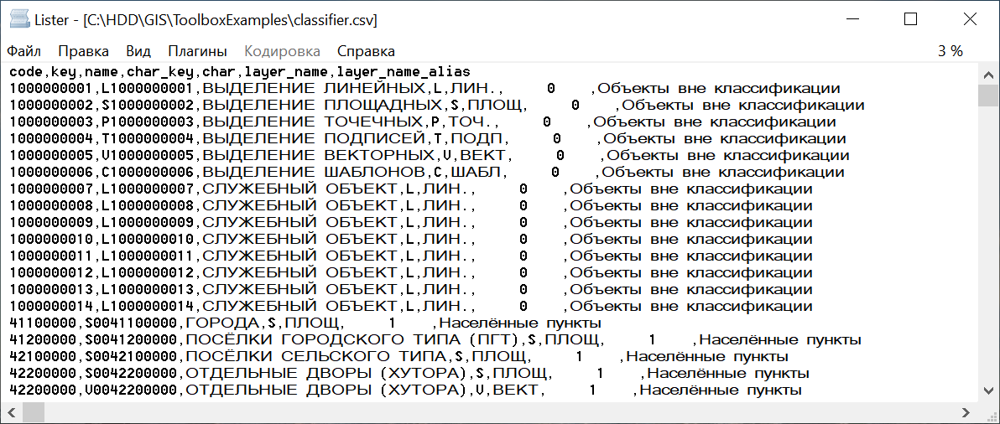

.. sectionauthor:: Юлия Григоренко <grigorenko.j@gmail.com>

Конвертация RSC в CSV 
==========================

Конвертация файла классификатора RSC из ГИС Панорама в CSV для анализа. Он используется для сравнения списка условных знаков в Панораме с другими программами.

**На входе:** RSC-файл

**На выходе:** CSV со списком знаков. 

   Полученный файл CSV

Запуск инструмента: https://toolbox.nextgis.com/operation/rsc2csv

**Попробуйте инструмент в действии, скачав наш пример:**

`Набор исходных данных <https://nextgis.ru/data/toolbox/rsc2csv/rsc2csv_inputs_ru.zip>`_ для проверки работы инструмента. Внутри архива пошаговая инструкция.

`Пример результата <https://nextgis.ru/data/toolbox/rsc2csv/rsc2csv_outputs_ru.zip>`_ работы инструмента.
