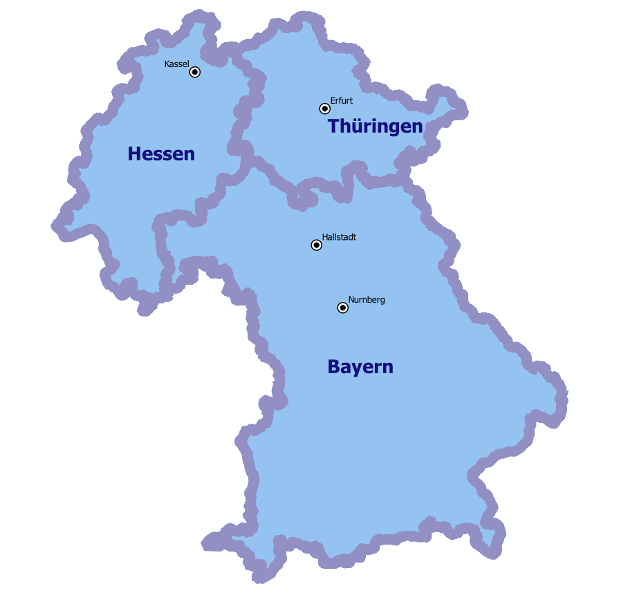
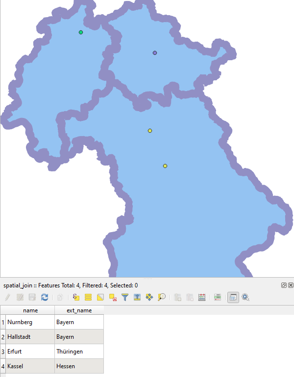

Пространственное объединение
============================

Добавляет к слою 1 атрибут с заданным названием из слоя 2, если объекты накладываются. Алгоритм так же известен как "Присоединить атрибуты по месторасположению", Spatial Join

На входе:

* Слой 1, любой тип геометрии
* Слой 2, полигоны
* Название атрибута из слоя 2

На выходе:

* Файл ZIP со слоем 1 и новым полем 
* Файл стиля

   
   Пример исходных данных - точки населённых пунктов и полигоны регионов.

   
   Выход - точки с добавленым атрибутом названия региона.
      

Запуск инструмента: https://toolbox.nextgis.com/operation/spatial_join

**Попробуйте инструмент в действии, скачав наш пример:**

`Набор исходных данных <https://nextgis.ru/data/toolbox/spatial_join/spatial_join_inputs_ru.zip>`_ для проверки работы инструмента. Внутри архива пошаговая инструкция.

`Пример результата <https://nextgis.ru/data/toolbox/spatial_join/spatial_join_outputs_ru.zip>`_ работы инструмента.
