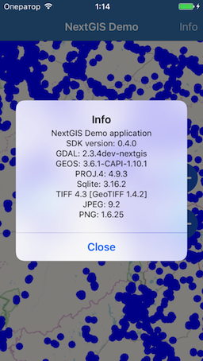

.. sectionauthor:: Dmitry Baryshnikov <dmitry.baryshnikov@nextgis.com>
.. NextGIS Mobile iOS SDK

SDK demo projects
==================

Simple map with points
------------------------

In this project created mobile application with one fullscreen map. Map consists of two layers:

* OpenStreetMap base map
* Vector layer with few points

The application screenshot is below.

The demo project `github page <https://github.com/nextgis/ios.mobile.demo>`_.

