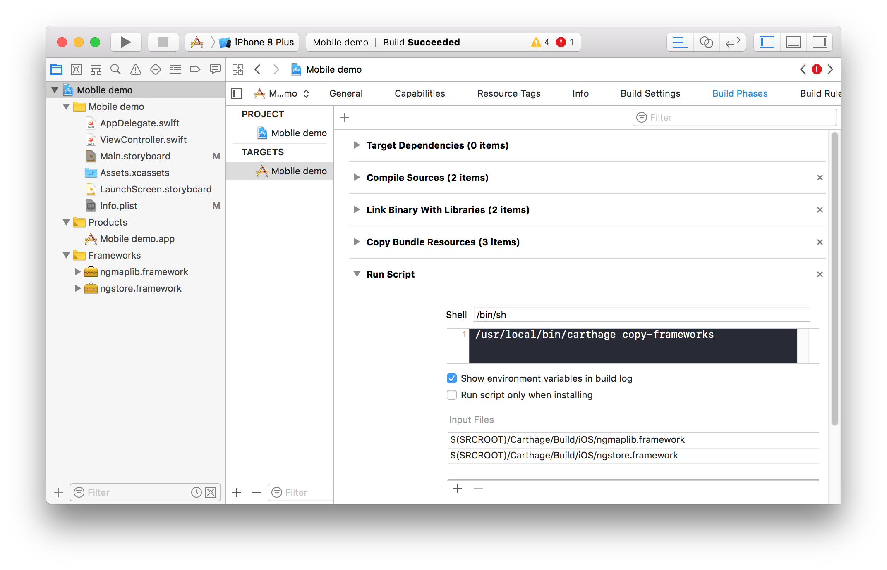
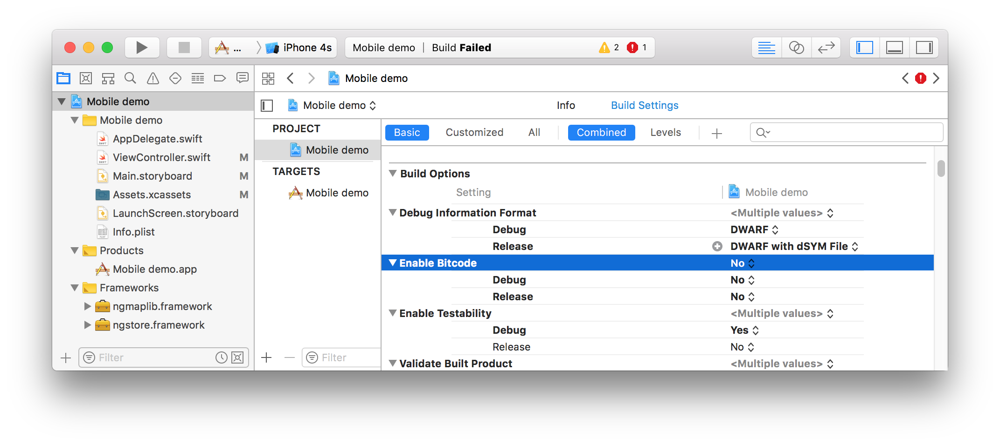
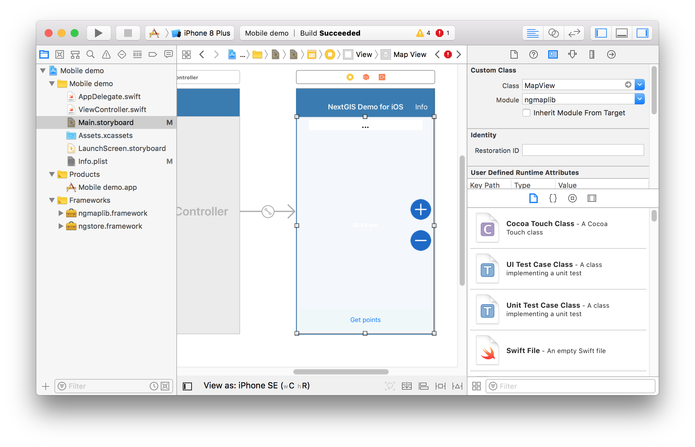

.. sectionauthor:: Dmitry Baryshnikov <dmitry.baryshnikov@nextgis.com>
.. NextGIS Mobile iOS SDK

NextGIS iOS SDK
================

Intro
----------

NextGIS iOS SDK is a set of libraries used to support work with geodata in mobile applications for iPhone and iPad. The SDK includes:

* `nextgis_datastore <https://github.com/nextgis/nextgis_datastore>`_ library
* `ios_maplib <https://github.com/nextgis/ios_maplib>`_ library

The **nextgis_datastore** library is written in ``С++11`` and based on `GDAL <http://gdal.org/>`_. The library supports the following functionality:

* create, modify and delete geodata (raster and vector)
* edit vector geodata (modify geometry and attributes)
* geodata management (copy, move, various formats import/export, etc.)
* geodata rendering as maps using `OpenGL/OpenGL ES`
* utility functions (network requests, oAuth2, json)
* ``nextgis.com``/``NextGIS Web`` integration (under development)

The library has ``С API`` and bindings to android java/kotlin programming languages using ``jni``.

The **ios_maplib** library is written in ``Swift`` and acts as easy wrapper around C API nextgis_datastore.

Install
----------

To use SDK the :program:`Xcode 8` or higher required. Also the ``Carthage`` utility required.  Carthage is intended to be the simplest way to add frameworks to your Cocoa application. To install Carthage follow instruction at `Cathage site <https://github.com/Carthage/Carthage/>`_.

In your project folder create ``Cartfile`` with following text:

.. code-block:: bash

   github "nextgis/ios_maplib"

In terminal execute command:

.. code-block:: bash

   carthage update --platform "iOS"

The command will download and install all necessary components.

Add to project
----------------------

To display current location on the map you need to add to Info.plist following pair fr key-value with ``String`` type:

.. code-block:: bash

   Privacy - Location When In Use Usage Description | String | Shows your location on the map

In your project ``General settings`` tab in ``Linked Frameworks and Libraries`` section, drag & drop``ngstore.framework`` and ``ngmaplib.framework`` from ``Carthage/Build/iOS`` folder.

.. figure:: _static/linked_frameworks_xcode.png
   :name: ngmobdev_linked_frameworks_xcode
   :align: center
   :width: 15cm

   **Linked Frameworks and Libraries** section in **General settings** tab.

Next you need to setup copying of ``ngstore.framework`` and ``ngmaplib.framework`` to building directory. In ``Build Phases`` tab click the ``+`` icon and in context menu select ``New Run Script Phase``. In  ``Run Script`` section add following text to the script area below the ``Shell``:

.. code-block:: bash

   /usr/local/bin/carthage copy-frameworks

Next add following lines to ``Input Files`` field:

.. code-block:: bash

   $(SRCROOT)/Carthage/Build/iOS/ngstore.framework
   $(SRCROOT)/Carthage/Build/iOS/ngmaplib.framework

   **Build Phases** tab.

The details see in `Carthage <https://github.com/Carthage/Carthage/>`_ documentaion.

The library was build with disabled **bitcode** option, so you need to disable it in your project as well. In your project settings select ``Build Settings`` tab and set option ``Enable bitcode NO`` for both build types (**Debug** and **Release**).

   **Build Settings** tab.

In the end add to your View controller the ``GLK View`` and set as a custom class ``MapView`` class from ``ngmaplib`` module or some derived class.

   Map view form setup.

SDK API References
-------------------

The SDK API reference can be found in :doc:`documentation <swift_api>`.

Demo projects
--------------

See demo projects at this :doc:`page <ios_demos>`.
