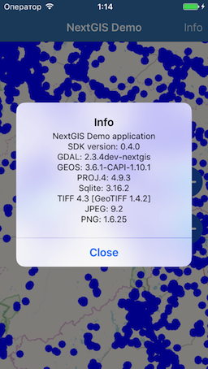

.. sectionauthor:: Дмитрий Барышников <dmitry.baryshnikov@nextgis.ru>
.. NextGIS Mobile iOS SDK

Демо проекты с использованием SDK 
==================================

Простая карта с точками
------------------------

В этом проекте создается мобильное приложение с одной картой на полный экран и двумя слоями в ней:

* Базовая карта OpenStreetMap
* Векторный слой с несколькими точками

Скриншот приложения представлен ниже.

Страница проекта на `github <https://github.com/nextgis/ios.mobile.demo>`_.
